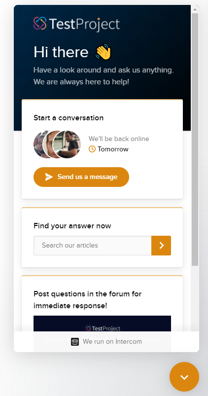

# Welcome to TestProject!

Welcome to the home of the TestProject documentation! You will find here resources to guide you as you learn how to use this test automation tool. TestProject is a powerful automation solution that aims to simplify your test automation experience. It also enables a full team approach to quality by enabling effective collaboration on test automation solutions.

It provides users with powerful record and playback capabilities along with a developer SDK and the ability to use and create addons to extend the capabilities as needed. TestProject is built on top of open source automation tools like Selenium and Appium, but it removes the complexity of managing and installing drivers for each platform and browser that you need to test. With the installation of single executable you have the ability to use all browsers and devices on a computer and you can instantly start recording, creating and executing tests.

TestProject is a community driven tool and has a free forever plan that is fully featured and that you can get started with in moments. Our documentation will help you with all the details you need to use TestProject to create effective test automation that your whole team can use.

* If you are new to TestProject, the [getting started guide](getting-started/creating-an-account.md) will walk you through getting setup so that you can start using this tool. This guide will help you with creating an account and walk you through the simple installation steps required to get any computer setup to use the collaborative test automation tool.
* You can also find documentation on how to use the TestProject recorder to create both [web ](using-the-smart-test-recorder/web-testing/)and [mobile ](using-the-smart-test-recorder/mobile-testing/)tests. This powerful and intuitive recording tool makes creating tests on any platform simple and straightforward.
* You will find information on how to [schedule and run ](schedule-and-run-tests/create-and-schedule-jobs.md)the tests that you create and information on [using addons](testproject-addons/using-addons-in-the-testproject-recorder.md) to extend your tests’ capabilities. 
* There are also [video tutorials](https://www.youtube.com/playlist?list=PL5qXkPB0T6VeyY1nGBf7hU8G2Zx3LrDwg) that you can follow along with that introduce some of the key concepts and ways of using this powerful test automation tool. 

Test automation is about more than just using tools. There are ways of thinking about it and approaching it that will help make you more effective as a tester so we also have a tips and tricks section in the documentation to help you with using TestProject at scale and to help you with using this tool to apply good automation practices to the tests you are creating.

**Support**

If you have any questions about any aspect of using TestProject we are always ready to help out. You can contact us through the built in chat that you will see on the bottom right hand side of our website and within the application itself. We also have a [forum](https://forum.testproject.io/) where you can ask questions and interact with other testers using our product. In addition you can check the FAQ to see if your question is answered there. If you have any questions or are stuck on anything, please do reach out to us. We would love to be of assistance to you.

