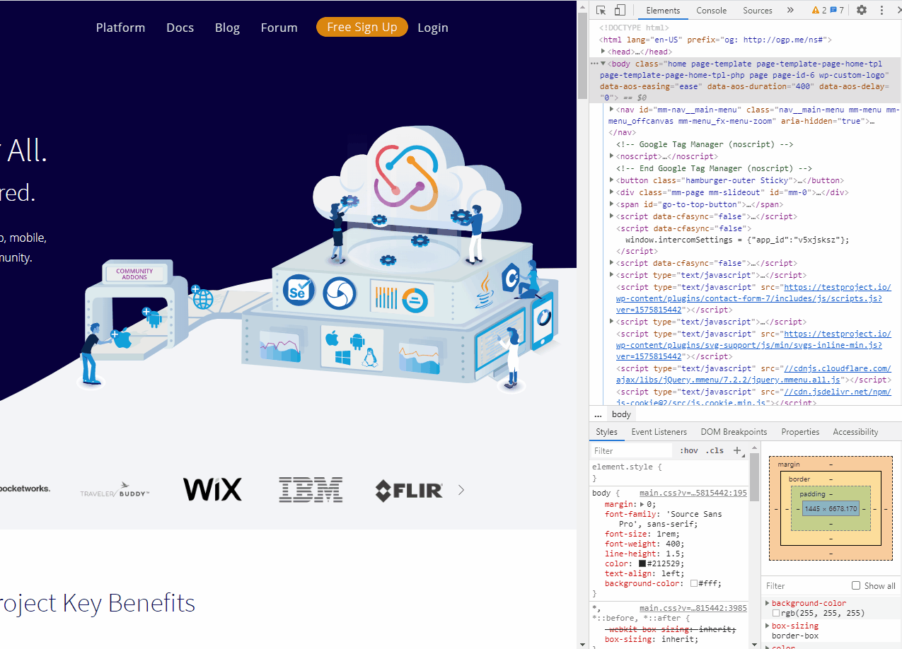

# Download HAR file

Sometimes if you have an issue related to a Web application you will be requested to share the HAR file which contains information about the problem.

In order to retrieve the HAR file, please perform the following points:

* Open developer tools using F12 on the keyboard.
* Navigate to the Network tab

.png>)

* Clear table content

.png>)

* Perform your desired action (Make sure the error you encountered happened)
* Right-click on one of the table rows
* Click 'Save all as HAR with content' and send the saved file to the team

.png>)

For example:

**Important note:**

Make sure to **record the error** you have encountered, if the error is not recorded in the network tab the HAR file will not contain the relevant information needed to resolve your issue.

\
