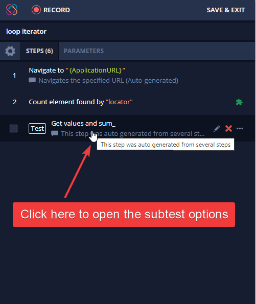

# Dynamic loop

When automating an application, sometimes you will need to loop through an undefined number of elements and perform actions with them. For example:

* Getting all elements text and saving the data into a CSV file.
* Check if each one of the elements contains a specific text.
* Sum all elements values.

In all these cases, we can create a loop using the same logic that will be explained in this article.

You can take a look at the following example and adapt it to your test case.

In this example, I will create a loop that gets all the “Price” values, and I’ll sum them:

* The first step will be finding a locator that matches all the elements that will be used in the loop. To achieve this, we can create a locator using the Locator tab and the element inspector and verify the locator using the 'evaluate' button.

* Then, we will need to manually add a step that counts the number of elements and store the value into a _**PROJECT** PARAMETER_ (that has a default value equals 35 - or any numeric value that will allow us to start the loop):

.png>)

*   The next step will be getting the value of the element and storing it into a parameter using a **** [**dynamic locator**](https://intercom.help/testprojectio/en/articles/3572418-how-to-create-dynamic-elements-in-testproject).

    NOTE: The element locator must depend on the parameter we have created in the first step.

* Then, as we want to sum all values, we’ll create a new parameter called “Total\_value” with default value “0”, and we will add a step that calculates the sum using the "mathematical expression" action:

* Now, let's **reduce '**1**'** from the parameter “Number\_of\_elements\_total” :&#x20;

* After adding all these steps, we are ready to create the loop.\
  To achieve that, first, we will need to group our steps into a test (except the one that counts the number of elements) and give it a name (let’s call our subtest “Get values and sum”).\
  _**NOTE: Once you group the steps, there is no “ungroup” option, so I suggest duplicating all steps and making sure it works before deleting the duplicated steps.**_

This is how you can group the steps into a subtest:

\

*   Now, let’s add a loop to this subtest with a condition. We can achieve that by opening the advanced options of this subtest:\

That’s it; the test is ready to be executed. Simply adapt the loop to your needs.😃

Happy testing! :)

\
