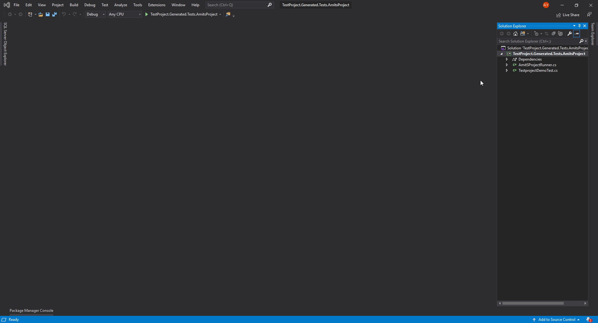

# How can I upload a coded test to TestProject

If you want to create your tests as coded tests by using our Java or C# Selenium and Appium Powered SDK, then once you finish developing your test in your favorite IDE, you need to upload it to TestProject.

A single Java/C# project can contain multiple test cases (represented by a class that implements the required interface). Once you upload your project to TestProject, it will be shown as a package that contains all the test cases inside it.

#### Uploading a Java project 

To upload a Java project, you need to compile your project to .jar file. You can use Gradle, Maven or any build tool that you like.

**For Gradle**: Open the **Gradle tab** and go to **Tasks/build/jar.** Once the jar task is finished, you will find your jar file here: **build/libs/YOUR\_JAR**

.png>)

.png>)

**For Maven**: Open the Maven tab, go to **Lifecycle** and execute: **clean, compile, package.** Once the package command is finished, you will find your jar file in the **target** folder (the jar without dependencies).

.png>)

.png>)

#### Uploading a C# project 

To upload a C# project, you will need to get the .dll file of the project.\
Right-click on your project in the Solution Explorer and click on build. Once the build is done, right-click again on the project and open it in file explorer. To get the .dll file: bin/Debug/netcoreappX.X upload the .dll file in that folder. If you have more than one .dll file, it means that you used addons proxy in your test and you need to include them too. Zip all the .dll files together and upload to TestProject:

#### Upload your Java/C# project to TestProject 

**Go to your project in TestProject and click on "Add a new Test":**

.png>)

**Select the "Code" option and click "Next":**

.png>)

**Drag and drop the jar/dll/zip file here:**

.png>)

**Click "Next":**

.png>)

**Select the platform, name, description and application:**

.png>)

That's it! You successfully uploaded your coded test to TestProject :)
