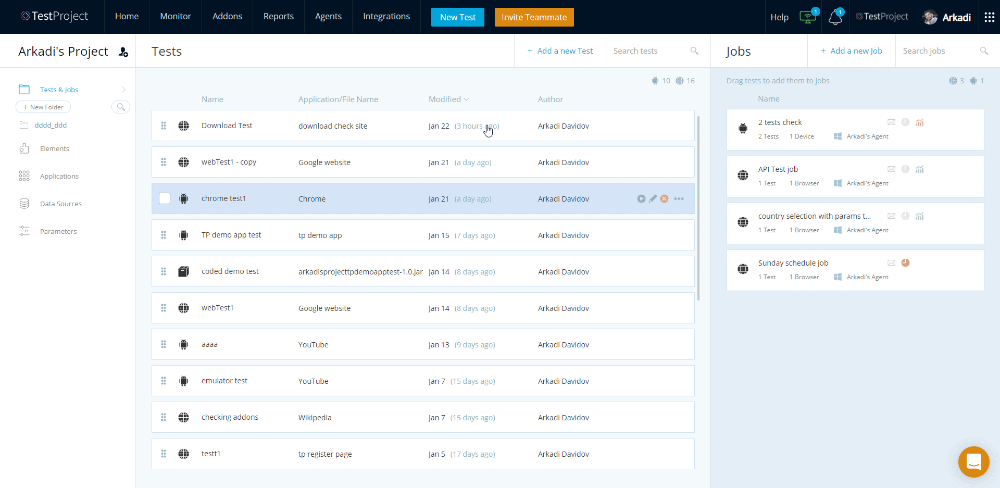
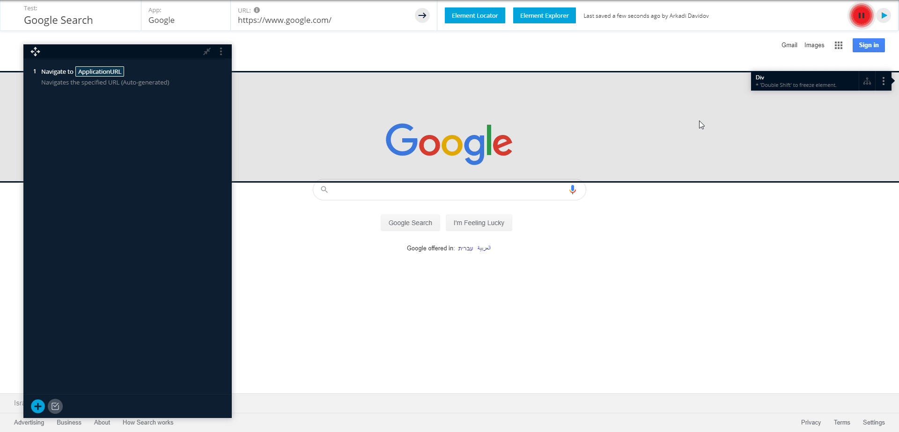
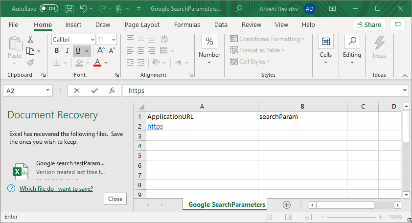

# How can I use external Data Source

Data-Driven Testing is when data is stored in a data source and then used as input for a test. With the TestProject platform, we give the ability to store many data sets in a data source. In order to access the information we define, we define the parameters we will use during our test, which I will explain in detail below.

## Creating a simple demonstration test case 

I will use the most popular website to demonstrate the following test case:

1. enter to [https://www.google.com](https://www.google.com/)
2. define search parameter that will be typed in the search box
3. Click on the search button.

## Generating the data source file 

Once the test is ready, we will download the 'Data Source Template' from our Project section:

1. close the recoded test
2. find your test from the Tests list
3. on the right side of your test, click on the three dots
4. Click on 'Data Source Template'

Now we will edit the CSV file we received. In the first line, you can see the two parameters we set: the **URL** and the **search parameter**. Each line below the parameter setting represents a test. We will build three test cases:

All left to do is run the test and select our Data Drive file:

1. from the tests list, choose your test and click on the run button&#x20;
2. choose the platform you want to perform the test on
3. Click on 'next.'
4. tag 'Use data source'
5. add your CSV file and give it a name
6. run your test with the data source file

.gif>)

Here are also a few video guides for working with data sources in TestProject:&#x20;

1. [https://www.youtube.com/watch?v=Xn4FmkIWsRQ\&t=6s](https://www.youtube.com/watch?v=Xn4FmkIWsRQ\&t=6s)
2. [https://www.youtube.com/watch?v=0hRnLDpXYz0](https://www.youtube.com/watch?v=0hRnLDpXYz0)
3. [https://www.youtube.com/watch?v=f1Yi-DPG1fY\&t=331s](https://www.youtube.com/watch?v=f1Yi-DPG1fY\&t=331s)
