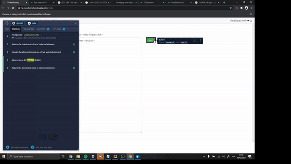
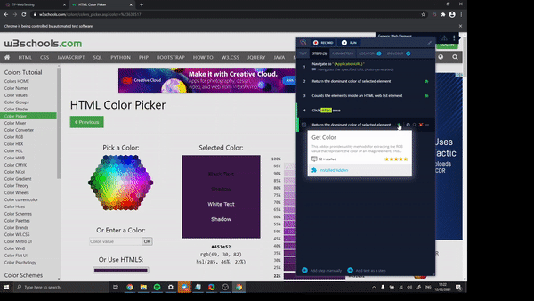

# How to validate colors of elements

If you ever need to validate the color of an element, we have an addon for that,

It's fairly easy to use just on the desired element and locate the **Get Color** action.

The get color action will return the dominant color of the chosen element in the RGB code.

What are the most common use cases for this addon?

• You have an element that changes color when clicked on or hovered, and you want to validate that it indeed changed it's color.

•You have a color picker in your mobile application/ web application, and you want to test that the color that is chosen is the right color.

•You have a background image of some element that changes based on some trigger that happens somewhere in your application.

•Elements with dynamic color, that changes all the time.

•Texts with different font colors, and you want to validate the font color of the text.

.gif>)

Generally, this addon is very useful and can be helpful in a lot of scenarios which include validating the colors of elements that might change their color based on other events or validating the color of static elements as well.

You can read more about it here [https://docs.testproject.io/testproject-addons/available-addons/get-element-color](https://docs.testproject.io/testproject-addons/available-addons/get-element-color)
