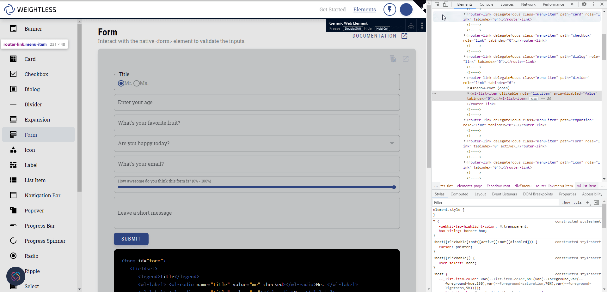

# Interact with Shadow DOM Elements

TestProject recorder currently does not handle Shadow Dom elements, but there is still a way to automate them! This article described how you could do that.

The way to automate a Shadow Dom element is by using JavaScript. Luckily TestProject has an Addon that can help us: 'Execute JavaScript.' This method allows us to perform any actions we want.

Here are the steps to follow to perform actions on the Element:

1. Create a step with the method Execute JavaScript

 (1).png>)

 (1).png>)

2\. Get into developer tools (F12 Button) or:

1. Click on the three dots at the top of your screen
2. click on more tools
3. click developer tools at the bottom

.png>)

Now we will find the js path of the element you want to act. This will serve as your locator.

4\. Now, it's time to build the action we want. Here are three examples for basic operations

1.  Click on the element:

    to do that, you will need to add the `.click()` function at the end of your locator:

.png>)

2\. Type text in element: to do that, you will need to add this to the end of the path you copied `.value="the text you want to put in"`

.png>)

3\. Get text to a parameter: to do that, you will need to add this to the start of the path you copied "return" and to the end ".textContent"

 (1).png>)

So as you can see, using execute javascript is very easy,

you can see all the actions you can make on the element in this link :

[https://www.w3schools.com/jsref/dom\_obj\_all.asp](https://www.w3schools.com/jsref/dom\_obj\_all.asp)
