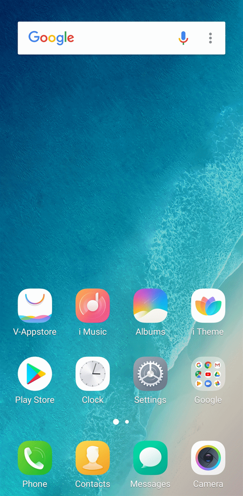
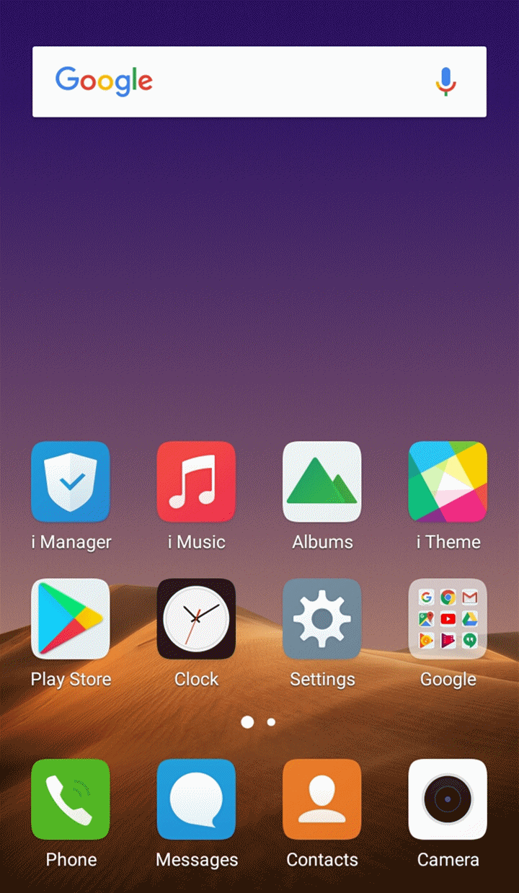

# Issues with running mobile tests on Vivo

When automating tests on Vivo devices, the device's power consumption feature may be interfering with our automation app.

You will need to allow:

```
io.appium.uiautomator2.server
```

Permission to run with high power consumption by adding it to the allowed list.\
\
Vivo devices run on _**Funtouch OS**_, so in order to do this, you will need to:\
For _**Funtouch OS 3.0**_ _**and a higher**_ version, go to:\
_**Settings > Battery > High background power consumption**_\
Then you can allow or disallow apps to run in the background even though they consume a lot of power.\




For the _**below**_ _**Funtouch OS 3.0 version**_, go to:\
**i Manager > Power manager > Excessive background battery usage**\
Then you can allow or disallow apps to run in the background even though they consume a lot of power.\



