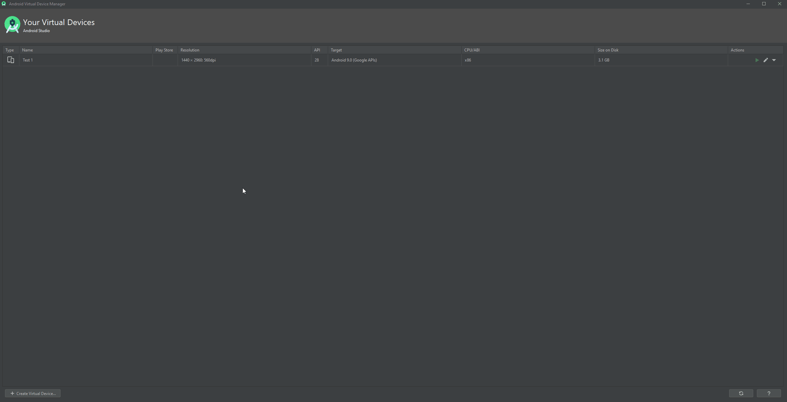

# Start Android Emulator using Android studio

Sometimes you want to record and execute tests on a device that is physically not available to you, that is why in TestProject you can use Emulators.

This is how you start an emulator from Android Studio:

First, you install android studio from here: [https://developer.android.com/studio](https://developer.android.com/studio)

After installation you go to tools-> AVD Manager:

\
Then you do the following:

 (2).png>)

Select the device you wish to emulate then select the version, after that you can fine tune it to your desires or just open the emulator and start testing.

#### Common Issues: 

1\) If the agent does not recognize the emulator after installation, please restart your agent.

2\) If you do not see the device on TestProject please set the following option on the Emulator and restart it:

 (2).png>)
