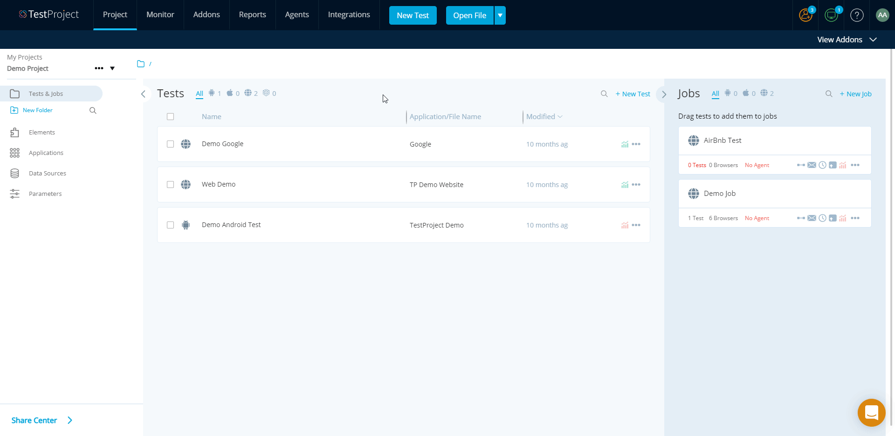

# TestProject Agent Logs

Sometimes when you report an issue you will be requested to provide your Agent logs. This is how you can find them.

#### Registered agent: 

If your agent is registered you can find the logs here:

#### Unregistered Agent logs: 

If your agent is not registered this is where you can find the logs:

**Windows**

Open the `Start` menu, type `%appdata%\TestProject\Agent\logs` and hit enter.

**macOS**\
\
Open `Files Finder` and choose `Go` form the top menu, select `Go to Folder` and type:\
 `~/Library/Application Support/TestProject/Agent`

**Linux**\
Navigate to `~/.testproject/agent/logs`\


Please zip the folder and send it over.

_**Note!**_

_1) It is very important to send with the logs an accurate timestamp of the event that you reported._

_2) Make sure the logs date back to the point of the event you have reported._
