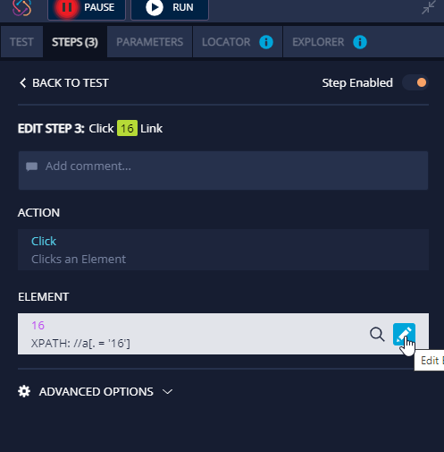

# How to create a dynamic date picker

First record the select day step:

then, go into the click step and change the day to a parameter in the locator:

.png>)

\
You need to delete all the locators and leave only the first one with the parameter so they do not affect the selection of the element.\
Now, let’s create the parameter so we can make the selection dynamic:

 (1).png>)

Create the parameter for the day:

.png>)

I chose the default day to be 1.

.png>)

You can select another value for this parameter from the parameter tab to 20 to, just for the example.

.png>)

Once I have the parameter I can do data-driven testing and so in each iteration, I will select other dates.

for more info about the data-driven testing you can go [here](https://docs.testproject.io/using-the-smart-test-recorder/using-data-driven-jobs-in-testproject).
