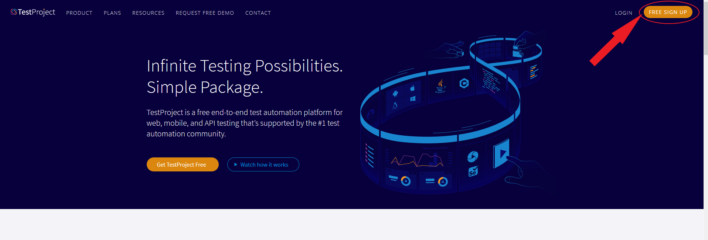
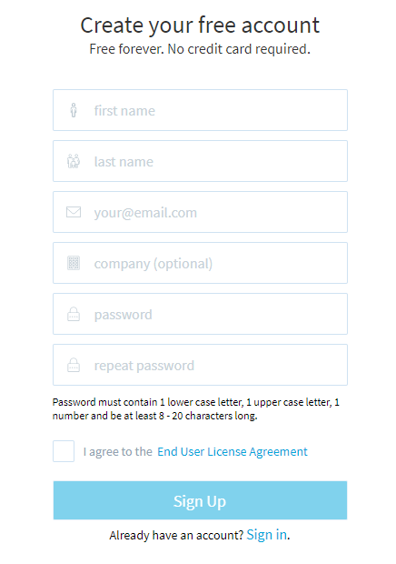

# Creating an Account

In order to use TestProject, you will need to have an account.  Creating an account is simple and free.  In order to get started, go the [test project main page](https://testproject.io/) and click on the Free Sign Up button.

On the signup page, enter in your email address, name and password along with your company name if you want. Once you agree to the license terms and click on the signup button, you will have your free account ready to use!

After signing in, you will need to install and setup an agent so that you can start using the powerful features TestProject has to offer



