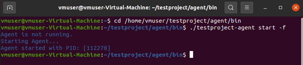

# Installation and Setup

Once you have [created an account](creating-an-account.md#registration) with TestProject you just need to follow a few simple steps to get setup and ready for testing. TestProject works on almost any platform, with the install of a single agent.

## Install TestProject Agent

### Download

The first thing you will need to do is login to the TestProject app. Once you have done that you can navigate to the agent's tab at the top of the page and choose the desired platform. You can also use this link to directly navigate to the [agent download](https://app.testproject.io/#/download) page. If you want to know more about the TestProject agent click [here](broken-reference).

### Installation

Now you are ready to install the TestProject agent on your machine. The installation is a very simple process, on macOS and Windows simply launch the installer and follow the instructions. For Linux follow this guide.


We support x64bit operating systems find more info [here](../supported-environments.md#supported-agent-operating-systems-x64-only).


### iOS on Windows

If you are going to use iOS devices on Windows you will require Apple Device Support which is automatically installed when installing [iTunes](https://support.apple.com/downloads/itunes).

## Start TestProject Agent

Once the Agent is installed you will need to start it.

### On Windows

The easiest way to run the agent is just to search for TestProject in the Windows search bar and click on the Agent to start it.

 (1).png>)

The agent will then start up on your computer and you will be able to see the status of it by right-clicking on the icon in the system tray.

### On Mac

On Mac, after you have installed the agent, you can run it by finding it in the application folder and double-clicking. This will open it in the dock and you can see the options on it by right-clicking the icon:

 (2).png>)

### On Linux

After downloading the installer let's install the Agent:

1. &#x20;Navigate to downloads.
2. Right-click on that file-> Properties-> Permissions-> check the "**Execute**" option. For headless you can use the command: `chmod +x ./TestProject_Agent_3.3.0.sh`
3. Open the folder that contains this file on terminal (right-click -> open in terminal) and type:

```
./TestProject_Agent_3.3.0.sh
```


Make sure to type the correct file name (agent version may differ)


After installing navigate to TestProject app:

```
cd /home/UserName/testproject/agent/bin
```


Don't forget to replace UserName with the actual user


Then start the agent in fork mode so you can use the current terminal:

```
./testproject-agent start -f
```

It should look like this:



## Register TestProject Agent

Once you have verified that the agent is running, you can now registered it to your account.

### UI Registration

Navigate to the TestProject app and choose the Register an Agent option from the [Agents menu](https://app.testproject.io/#/agents).


You will be prompted to give your agent an alias. Put something meaningful in here like "Joe Smith's Windows laptop" as it is possible to share agents with other team members. Once you have done that you just need to click on the register button to automatically register your agent with the TestProject application, and you are ready to start using TestProject!

### CLI - Remote/Headless Registration


This method can be used for remote and headless registration.


To register your agent to an account using a CLI on any machine you will need to generate an [API key](https://app.testproject.io/#/integrations/api). The API key will determine to which account this agent will register.

#### For Linux

Once you have your [API key](https://app.testproject.io/#/integrations/api) head over to the terminal and make sure your agent is running.

You can verify it [here](installation-and-setup.md#on-linux).

Now to register your agent use this command:

```
./testproject-agent register -a agentName -t Your_API_Key
```

It should look like this:


#### For Windows

First, make sure your agent is running you can check [here](installation-and-setup.md#on-windows).

Simply execute this command on your shell or CMD:

```
testproject-agent register -a agentName -t Your_API_Key
```

It should look like this:

 (2).png>)

If your windows does not recognize `testproject-agent` commands:

Add TestProject agent to your environment variables

Head to Control Panel -> All Control Panel Items -> System -> Advanced system settings -> Advanced -> Environment Variables -> Path -> New

Variable value: `C:\Program Files\TestProject Agent`

You can use the image below:


