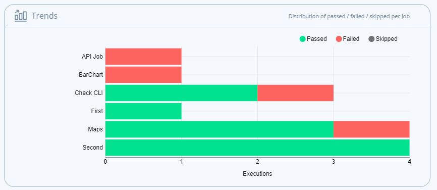

# Trends Chart

The TestProject Trends chart lets you see the passed/failed/skipped distribution of [jobs](../../schedule-and-run-tests/create-and-schedule-jobs.md). You can see the number of runs of each job that have passed or failed and compare that to how other jobs are doing.

The Trends chart can be found on the same page as the targets chart by clicking on the third dot under the charts view.

These charts are available as a high level summary of all tests run or to summarize each project that you have setup. 

