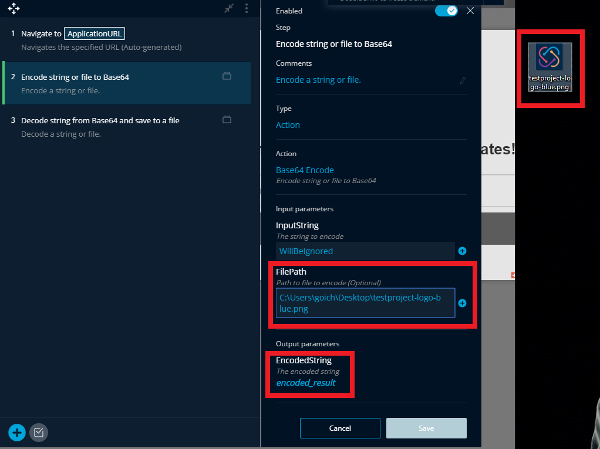
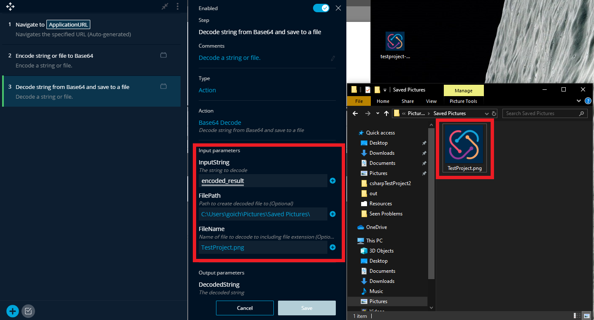

# Base64 Encoder/Decoder Addon

The Base64 Encoder/Decoder Addon allows you to encode and decode strings or files \(which are up to 512KB\) during your tests, by utilizing the "Base64 Encode" and "Base64 Decode" actions.

The Addon contains two actions, the first for encoding and the second for decoding:

* Base64 Encode
* Base64 Decode

### **Base64 Encode**

Input parameters:

* InputString – A string to encode
* FilePath – Path to file to encode

Output parameters:

* EncodedString – The encoded string from your string or file


Please note, only files up to 512kb can be encoded.


### **Base64 Decode**

Input parameters:

* InputString – A string to decode
* FilePath – Path to decode a file to
* FileName – The name of the decoded file including the file extension \(e.g. .txt, .doc etc\)

Output parameters:

* DecodedString – The decoded input string or successful notification for files


Please note, the file path parameter is mandatory if creating a file, however the filename defaults to a .txt file named after the current system’s time and date.


### **Example**

In the following example, we will encode a .png image file, and decode it in another location.

I have specified the file path to the image and saved the result in a parameter called encoded\_result.

You can see that I have also entered an input string, however since I have also entered a file path, it will be ignored.

Now, I will run the decoder.

Here, I will decode the result string from the encoder that I saved as a parameter.

I will save it in my ‘Saved Pictures’ folder as another .png file named ‘TestProject’.

