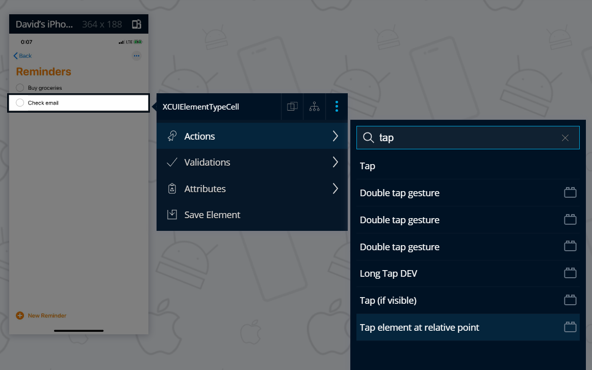
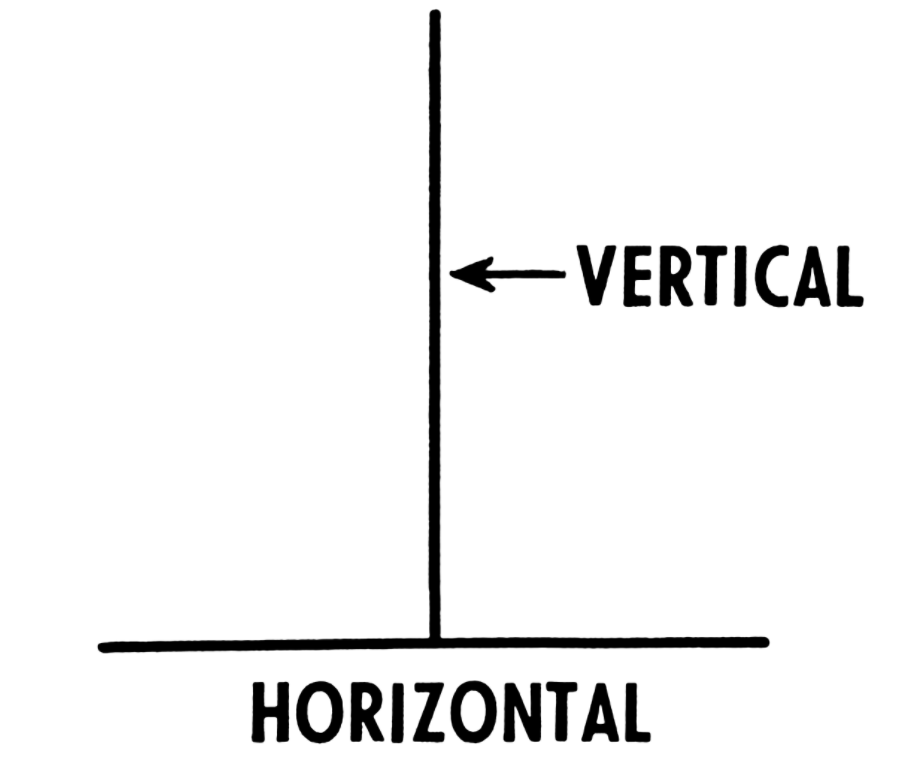
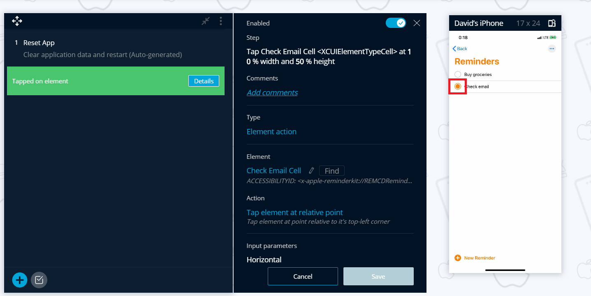

# Element Extensions Addon

TestProject comes with many built in element actions, but the Element Extensions addon expands on these and gives you access to many more ways of interacting with an element. The element action in this addon are for web, Android and iOS platforms. &#x20;

One important action this addons provides is the ability to switch between iframes. You can see an example of how to use this [here](../../tips-and-tricks/using-testproject-with-iframes.md) in the documentation. **** Another action this addon provides is the Tap Element at Relative Point.

**Tap Element at Relative Point**


In cases where you might need to tap on a specific part of a mobile element (both Android or iOS), you can use the **Tap element at relative point** action.

The action is an **element action**, and can be found from the context menu through each element in the mobile application:

The action has two parameters, the **Horizontal** tap percentage and the **Vertical** tap percentage from the **top-left** corner of the element.


Meaning, if you set both the values to 50, the tap will be on the center of the element.

In the following example, we will perform a tap on the checkbox, which is in the middle of the left side of the element.

To do so, we will set the horizontal parameter to 10 and the vertical parameter to 50:

