# HTML Table Actions

With the [HTML Table actions Addon](https://addons.testproject.io/html-table-actions) you can perform various tasks on HTML tables.


The most important thing is to capture the table element in the HTML DOM.


This is how you can capture such elements using the [smart test recorder](https://testproject.io/smart-test-recorder/):

* You can either capture the table itself with the element inspector and press double shift:

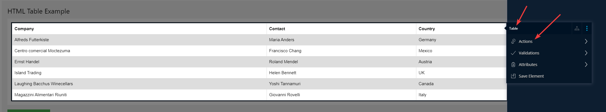

*
  Or you can select one of the table cells using the element inspector and press double shift, click on **Parent Element** button and select the table:

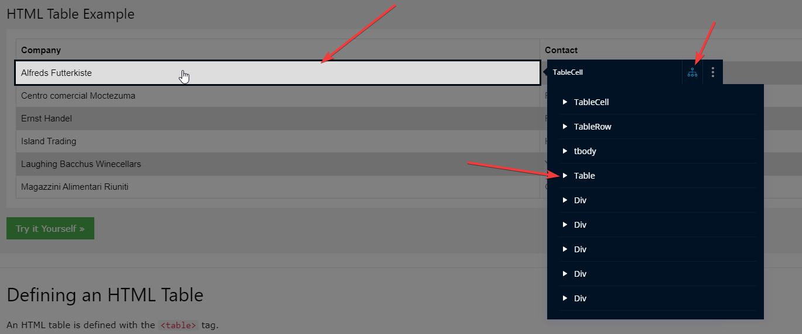


Once you've captured the table element, select **Actions**, where you will see all available actions on such element.

Let’s see the available actions for [this addon](https://addons.testproject.io/html-table-actions):

**1.Click on link at a given row (row. Column)**:\
\
Input parameters:

* **Row **– The row where the table cell is located.
* **Column **– The column where the table cell is located.\
  Both of them are zero based (meaning it starts from 0).
* **LinkText  **- The text of the link to be pressed inside the table cell.\
  \
  ** **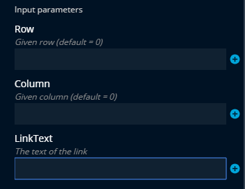** ** \

**2. Click on given cell**: This action presses on a given table cell.\
\
Input parameters:

* **Row **– The row where the table cell is located.
* **Column** – The column where the table cell is located.\
  Both of them are zero based (meaning it starts from 0).\
  \
  ** **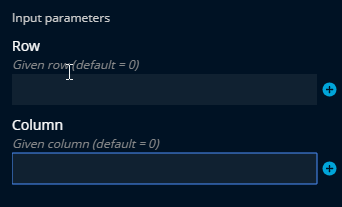 \

**3. Create CSV file from table**: This action creates a CSV file from the table.

Input parameters (Both Required):

* **NameOfFile **– The name that will be given to the CSV file.
* **LocalPathToFile **– The path where the file will be saved.\
  \
  &#x20;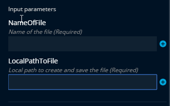 \
  \
  Note: Headers will be the first row of the table.\
  For example, this row in image below will be the headers in the CSV file:

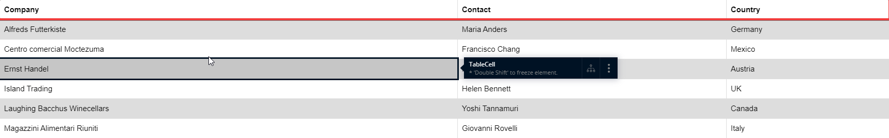

****\
**4. Search text**:

Input parameter - **TextToSearch**: The text to search inside the table.

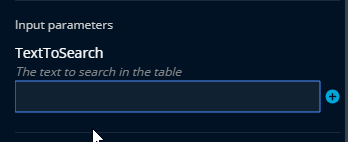

Output parameters:

* **TextFound **– The result if the text was found (true/false).
* **RowIndex **– The row of the cell that contains the text.
* **ColumnIndex** – The column of the cell that contains the text.

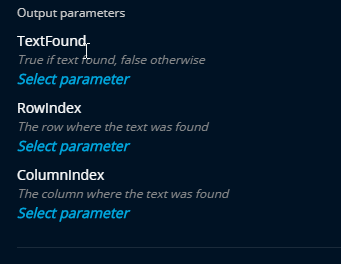

**5. Get Text from a given cell**: This action returns the text contained in a specific table cell

Input parameters:

* **Row **– The row where the table cell is located.
* **Column **– The column where the table cell is located.\
  Both of them are zero based (meaning it starts from 0).

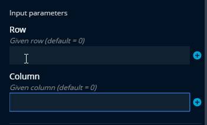

Output Parameters: **Text **- The text contained in the given cell.

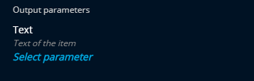

****

**6. Read entire table**: This action returns the entire text of the table as a comma delimited string.

Output parameter: **TableOutput **– The entire table as a comma delimited string.

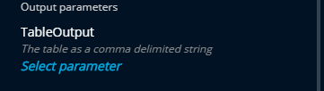

Example:

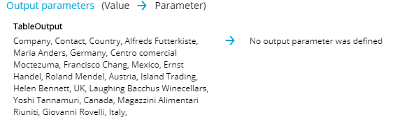
