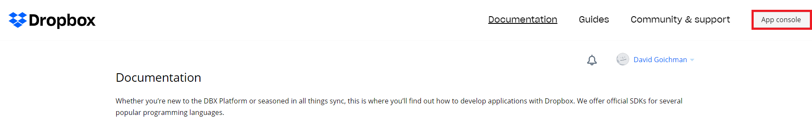
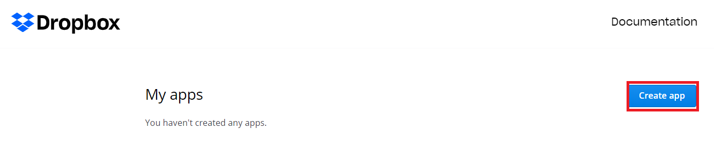
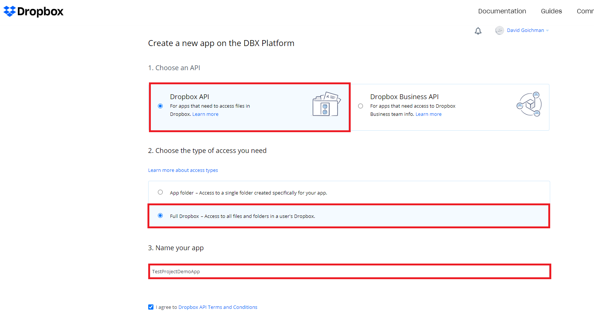
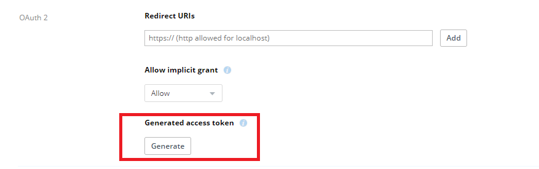
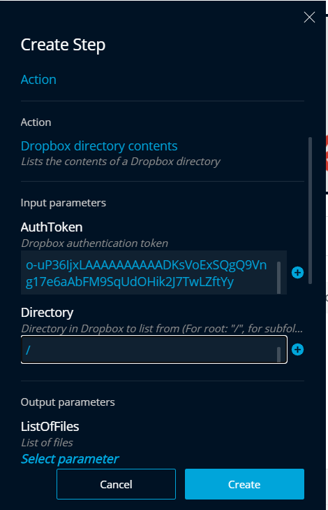
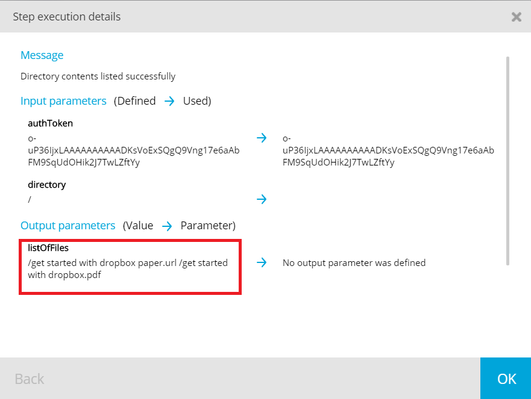

# Dropbox Actions

As part of the [Image Comparison Addon](https://docs.testproject.io/testproject-addons/available-addons/image-comparison-addon), you can find cool actions to interact with files you have stored in your Dropbox account, such as:

* List the contents of your Dropbox directory
* Upload / Delete / Download files from your Dropbox storage
* Save element screenshots to Dropbox
* Compare images from Dropbox

## How to Get Started with Dropbox Actions?

First, you need to create a **free Dropbox account** by navigating to their site: [https://www.dropbox.com/basic](https://www.dropbox.com/basic).   
  
Once you have a Dropbox account set and ready, you need to create a **Generated Access Token** to be able to access your Dropbox storage through the TestProject Dropbox Actions Addon.   
  
Go to the Dropbox developer section [here](https://www.dropbox.com/developers/documentation) and **create a new app**.

  
Configure your settings as follows:

  
Now, you will have the option to generate a token:


  
This token will need to be inserted into **every Dropbox related action**, in order to access and interact with files you have stored on your Dropbox.

## Example for Using Dropbox Actions with TestProject

The following example will list the contents of my Dropbox root directory:


We’ve filled in our Dropbox token and “/” as the directory, meaning we'd like to view the contents of our Dropbox root directory.

This is the result: both files created by Dropbox upon registration.

This is just one example of the available Dropbox actions. In the [Image Comparison Addon](https://docs.testproject.io/testproject-addons/available-addons/image-comparison-addon) actions you can find additional Dropbox related actions including: **uploading, deleting and downloading files** from your Storage, **saving element screenshots to Dropbox** and **comparing images from Dropbox**.

