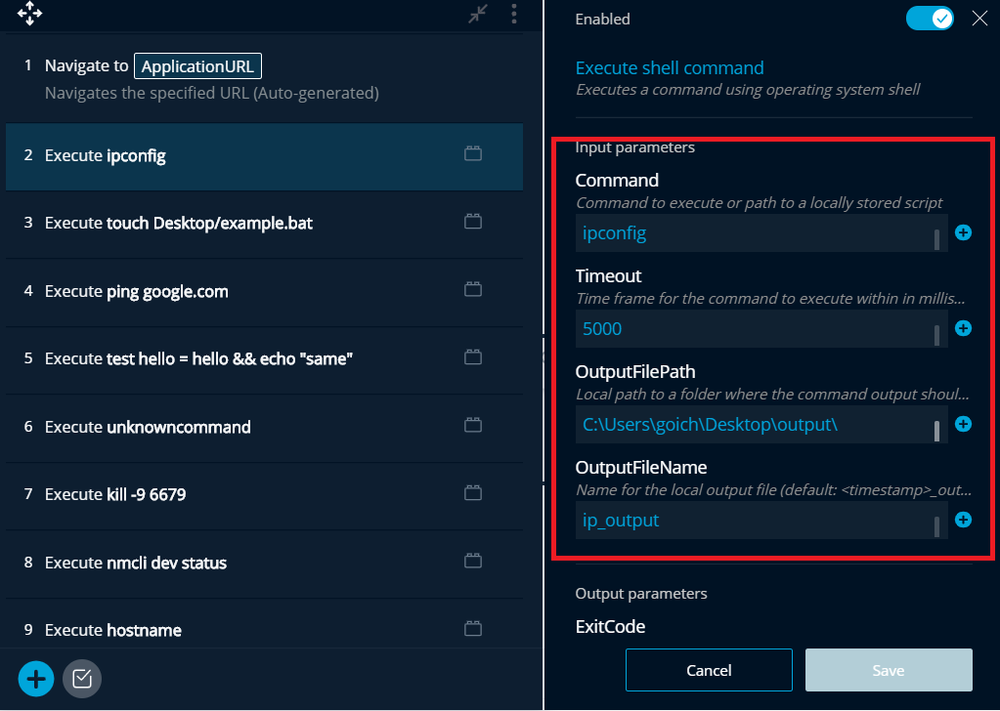
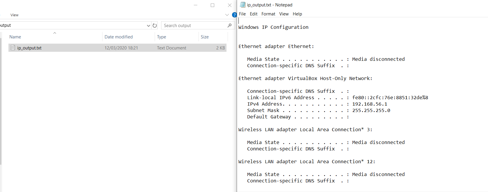
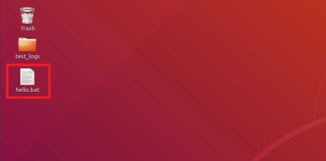
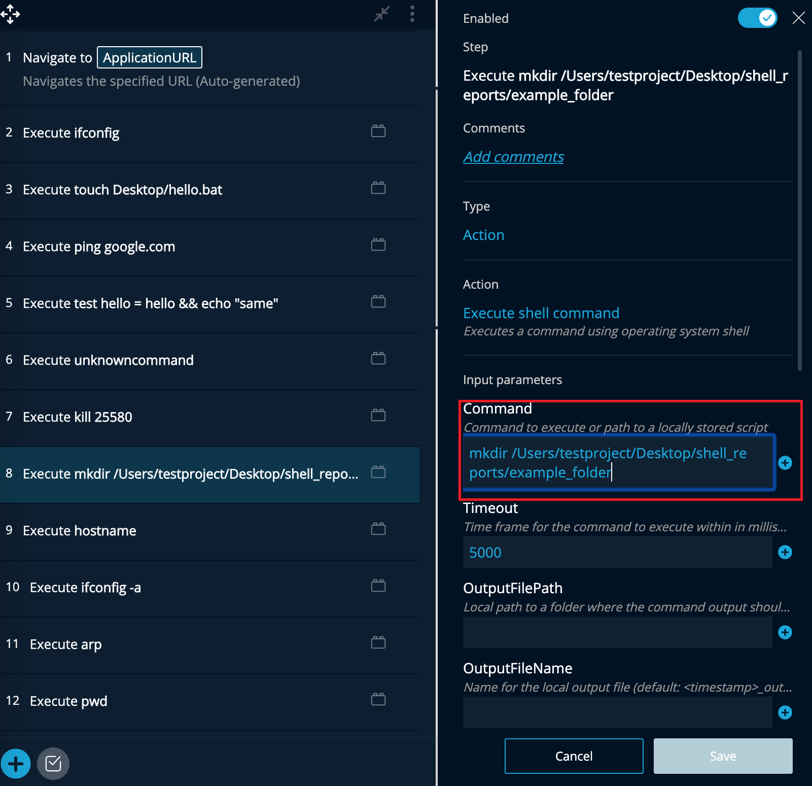

# Shell Commands

The [Shell Commands Addon](https://addons.testproject.io/shell-commands) allows you to execute commands and scripts while running your tests. It supports all major operating systems: Windows \(CMD\), Linux \(sh\) and macOS. By utilizing “Command” parameter, you can execute any system command or a locally stored script.

If you ever need to send system shell commands or run scripts during your tests, this Addon will allow you to do so.

### **Actions**

This Addon contains a single action for sending those commands called: 'Execute'.

The **input** parameters are: 

* Command 
* Timeout
* Output file path
* Output file name.

The **output** parameters are: 

* The exit code
* The output file path.

\*\*Please note, that the step will be considered passed even if the command itself fails.

### **Examples**

#### **Windows:**

In this example we’ll run the “ipconfig” command. Since the command itself is endless, let's add a timeout. We’ll place the output of the command in a file in order to review it once we complete our test run:

Now, we are able to see the output of the command in our desired file:

#### **Linux:**

In this example, we will create a .bat file on our Linux desktop. We’ll create a new step using the Execute action and type the command “touch path/hello.bat”:

Once we complete the test run, we can see the file was created as expected on our desktop:

#### **macOS:**

In this example, we’ll create a new folder within a folder on our macOS desktop. We will use the Execute action with the command “mkdir path folder\_name.”:

Once we complete our test run, we'll be able to see the new folder at the desired location:

