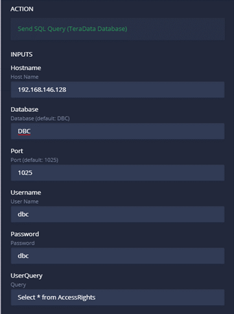
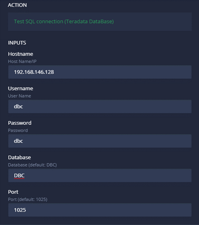

# Teradata Database Addon

This addon allows you to test connections and to send queries to Teradata databases. You can use this addon to send an SQL query and get the response. Then, you can compare this output with the UI data.

### **Available Actions**


`Send SQL Query (TeraData Database)` - Send a SQL query to a Teradata Database

This action takes in the following input parameters:

* `Host` – Name/IP of the host machine where the database is (required)
* `Port `- Port number to connect to (default port is 1025 if none specified)
* `Username `- Username to connect to the database (required)
* `Password `- Password for connecting to the database (required)
* `UserQuery `- The SQL query you want to execute

For example:

`Test SQL Connection (TeraData Database)` - Test the connection to the Teradata database

This action takes in the following input parameters:

* `Host `– Name/IP of the host machine where the database is (required)
* `Port `- Port number to connect to (default port is 1025 if none specified)
* `Username `- Username to connect to the database (required)
* `Password` - Password for connecting to the database (required)

For example:

