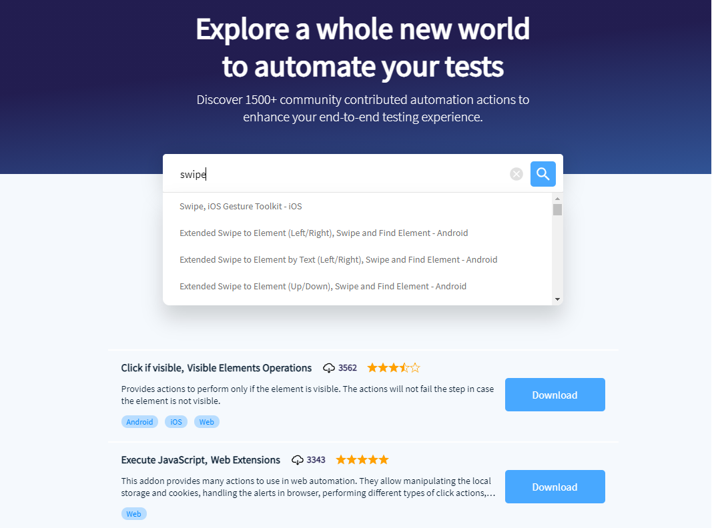

# What is an Addon?

TestProject provides a powerful feature set by default, but sometimes there are additional actions you need to do in a test. This is where addons come into play. An addon is a collection of ready-to-use coded automation actions you can use within any test to help you effortlessly extend your recorded and coded tests with reusable actions.

The vision behind the [Addons library](https://addons.testproject.io/) is simple: save valuable development time and effort while creating test automation. Addons are stored in a collaborative library on TestProject‘s free test automation platform, and they are developed & shared by the entire community to the public Addons library.

The Addons library already has 1,500+ automation actions and all of them are 100% free. You can also create your own addons that you can share with your team or with the entire TestProject community if you wish. Addons make it easy to customize the actions you have in your tests to exactly fit your team's particular testing needs. Check out how to get started with creating addons [here ](develop-an-addon/)in the documentation.

Some examples of popular addons in the library include an addon that allows you to make RESTful API calls, an addon for slack actions and an ADB Wrapper addon that lets you execute android debugging commands on your android device.

There are many other addons available as well, so if you are looking for a particular command or action checkout the addons section of TestProject.

Or explore the public Addons library [here](https://addons.testproject.io/).

