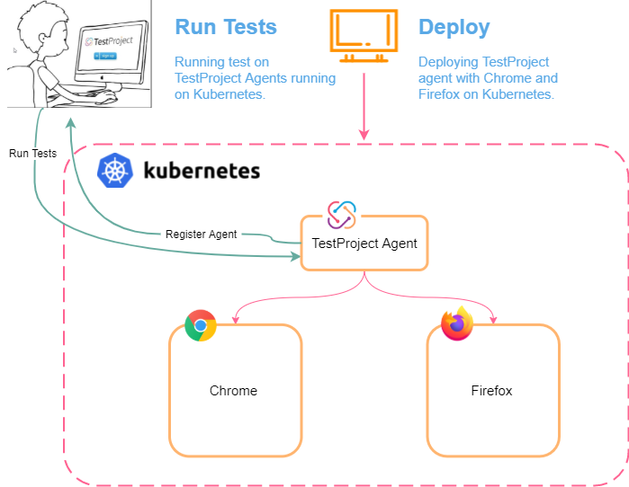
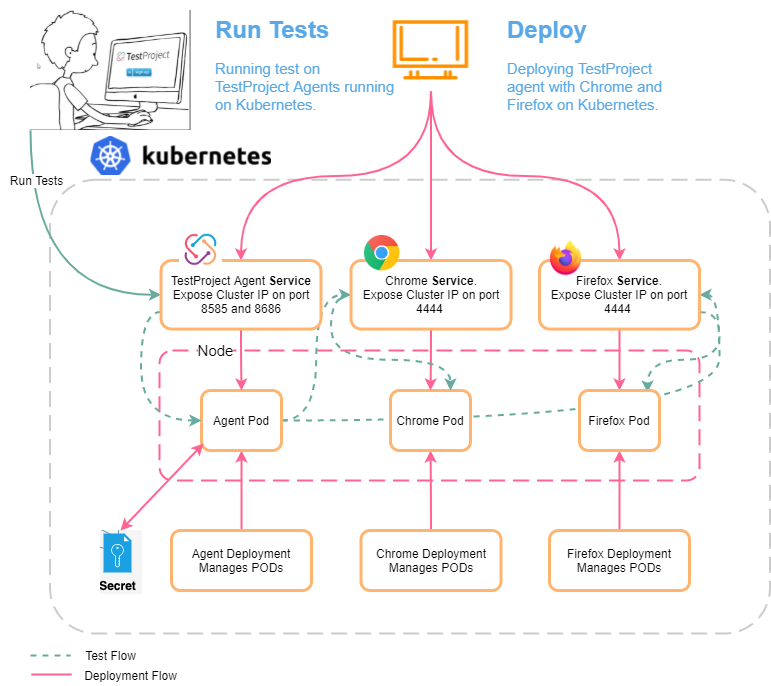

# TestProject Agent on Kubernetes

## Use cases

* Parallel tests execution.
* Setup many agents in seconds.
* Test different browser versions.
* Save time in the execution of your test suites.&#x20;

## **Diagram **&#x20;



## Requirements

* Kubernetes cluster
* kubectl
* TestProject Agent => v0.66.4&#x20;

## Deployment

This YAML snippet spins up 3 deployments:

1. TestProject Agent
2. Standalone selenium with pre-installed Chrome
3. Standalone selenium with pre-installed Firefox

The TestProject Agent will automatically detect the Chrome & Firefox containers.

By setting the `TP_API_KEY` environment variable we instruct the Agent to automatically register TestProject Agent. The API key can be created in the TestProject Web Application (as described [here](https://docs.testproject.io/api/getting-started-with-using-the-testproject-api)).

1. For enhanced security, it's recommended to use Kubernetes secrets for setting the TP\_API\_KEY.\
   &#x20;Create file '.secret' with `TP_API_KEY`.\
   &#x20;Then create the `testproject-secrets` as following:\


```
kubectl create secret generic testproject-secrets --from-literal "TP_API_KEY=$(cat .secret)"
```

2\. Save the code below as `k8s-testproject.yaml` , then execute that YAML file in your local Kubernetes environment.

```bash
kubectl apply -f k8s-testproject.yaml
```

Content of `k8s-testproject.yaml` as following:

```yaml
# To execute this yml file use this command in your local kubernetes environment `kubectl apply -f k8s-testproject.yaml
#***************************************
#SELENIUM STANDALONE CHROME
#***************************************
apiVersion: v1
kind: Service
metadata:
  name: chrome
  labels:
    name: selenium-standalone-chrome
spec:
  selector:
    app: selenium-standalone-chrome
  ports:
    - name: "chrome"
      protocol: TCP    
      port: 4444
      targetPort: 4444
---
apiVersion: apps/v1
kind: Deployment
metadata:
  name: chrome
  labels:
    app: selenium-standalone-chrome
    name: selenium-standalone-chrome
spec:
  replicas: 1
  selector:
    matchLabels:
      app: selenium-standalone-chrome
  strategy:
    type: Recreate
  template:
    metadata:
      labels:
        app: selenium-standalone-chrome
        name: selenium-standalone-chrome
      labels:
        app: selenium-standalone-chrome
        name: selenium-standalone-chrome                              
    spec:
      restartPolicy: Always        
      containers:
        - image: selenium/standalone-chrome
          name: chrome       
          ports:
            - containerPort: 4444       
          volumeMounts:
            - name: dshm
              mountPath: /dev/shm
      volumes:
        - name: dshm
          emptyDir: { "medium": "Memory" }
---          
#***************************************
#SELENIUM STANDALONE FIREFOX
#*************************************** 
apiVersion: v1
kind: Service
metadata:
  name: firefox
  labels:
    name: selenium-standalone-firefox
spec:
  selector:
    app: selenium-standalone-firefox
  ports:
    - name: "firefox"
      protocol: TCP    
      port: 4444
      targetPort: 4444
---
apiVersion: apps/v1
kind: Deployment
metadata:
  name: firefox
  labels:
    app: selenium-standalone-firefox
    name: selenium-standalone-firefox
spec:
  replicas: 1
  selector:
    matchLabels:
      app: selenium-standalone-firefox
  strategy:
    type: Recreate
  template:
    metadata:
      labels:
        app: selenium-standalone-firefox
        name: selenium-standalone-firefox
      labels:
        app: selenium-standalone-firefox
        name: selenium-standalone-firefox                              
    spec:
      restartPolicy: Always        
      containers:
        - image: selenium/standalone-firefox
          name: firefox       
          ports:
            - containerPort: 4444
          volumeMounts:
            - name: dshm
              mountPath: /dev/shm
      volumes:
        - name: dshm
          emptyDir: { "medium": "Memory" }
---            
#***************************************
#TESTPROJECT AGENT
#***************************************           
apiVersion: v1
kind: Service
metadata:
  name: testproject-agent
  labels:
    name: testproject-agent
spec:
  selector:
    app: testproject-agent
  ports:
    - name: "8585"
      port: 8585
      targetPort: 8585
    - name: "8686"
      port: 8686
      targetPort: 8686
---
apiVersion: apps/v1
kind: Deployment
metadata:
  labels:
    app: testproject-agent
    name: testproject-agent
  name: testproject-agent
spec:
  replicas: 1
  selector:
    matchLabels:
      app: testproject-agent
  template:
    metadata:
      labels:
        app: testproject-agent
        name: testproject-agent
    spec:
      restartPolicy: Always    
      containers:
        - env:
            - name: CHROME
              value: chrome:4444
            - name: FIREFOX
              value: firefox:4444
            - name: TP_AGENT_TEMP
              value: "true"
            - name: TP_AGENT_ALIAS # OPTIONAL variable that can be used for registering the agent with a custom alias.
              value: "My First k8s Agent" 
            - name: TP_API_KEY # The API key can be created in the TestProject Web Application (as described https://docs.testproject.io/testproject-integrations/integration-with-jenkins#creating-a-testproject-api-key).
              valueFrom:
                secretKeyRef:
                  name: testproject-secrets
                  key: TP_API_KEY  
              valueFrom:
                secretKeyRef:
                  name: testproject-secrets
                  key: TP_API_KEY             
            - name: TP_SDK_PORT # Agent will listen on port 8686 for SDK connections
              value: "8686"
          image: testproject/agent:latest
          name: testproject-agent
          ports:
            - containerPort: 8585
            - containerPort: 8686  
          livenessProbe: # The chrome pod take about ~30 sec to be ready. We need to start agent registration ONLY when booth Firefox and Chrome is available. 
            exec:
              command:
              - /bin/sh
              - -c              
              - curl -sSL http://chrome:4444/wd/hub/status | jq -r '.value.ready' | grep "true" || exit 1              
            initialDelaySeconds: 30
            periodSeconds: 5
   
```

## Running multiple agents

* The following will bring up an additional agent named `My First k8s Agent-2`

```yaml
cat k8s-testproject.yaml  | sed "s/My First k8s Agent/My First k8s Agent-2/g" | sed "s/testproject-agent/testproject-agent-2/g" | kubectl apply -f - ;
```

* As result, You will have 2 TestProject Agents:\

  * The first one from the firstly run with default parameters bring up the latest Firefox and Chrome
  * The second brings up an additional agent named  `My First k8s Agent-2` that work against the same Firefox and Chrome as `My First k8s Agent `


## Test different browser versions

*   The following  will bring up an additional TestProject agent named `My First k8s Agent-3`

    Firefox with version `standalone-firefox:86.0`

```
cat k8s-testproject.yaml  | sed "s/My First k8s Agent/My First k8s Agent-3/g" | sed "s/testproject-agent/testproject-agent-3/g" |  sed "s/name: firefox/name: firefox-3/g" | sed "s/selenium\/standalone-firefox/selenium\/standalone-firefox:86.0/g" | kubectl apply -f - ;
```

* As result, you will have 3 TestProject Agents:\

  * the first one `My First k8s Agent` from the firstly run with default parameters and the latest Firefox and Chrome
  * the second `My First k8s Agent-2` running with default parameters and the latest Firefox and Chrome
  * the third `My First k8s Agent-3` that work against the latest Chrome but Firefox:86.0


## Flow




