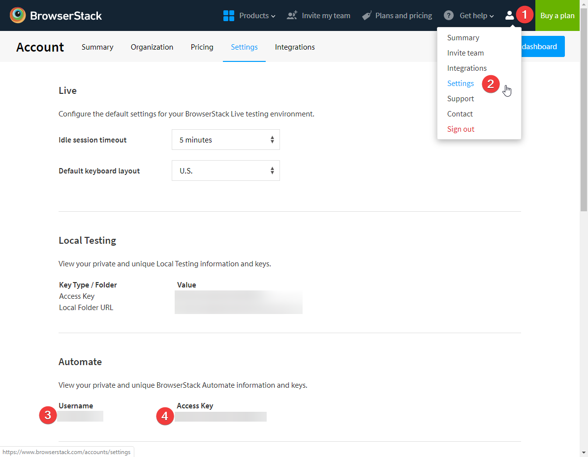
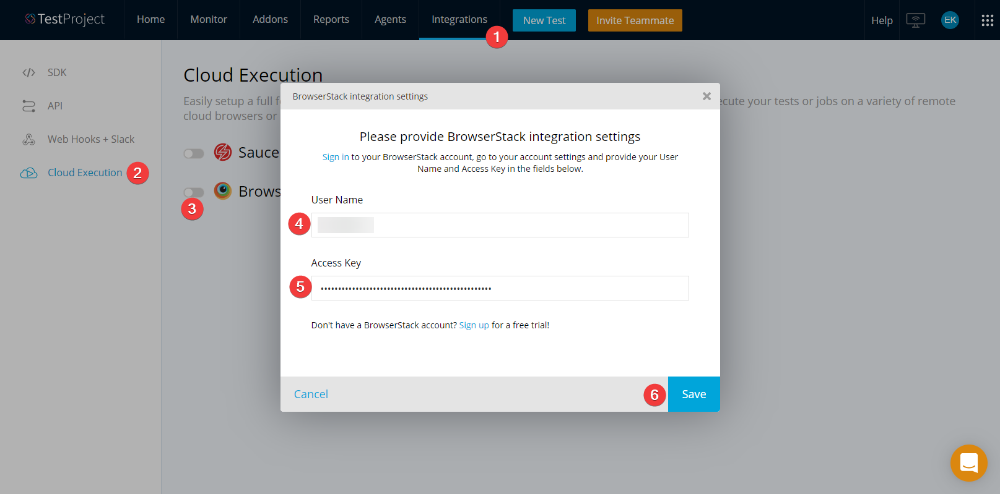
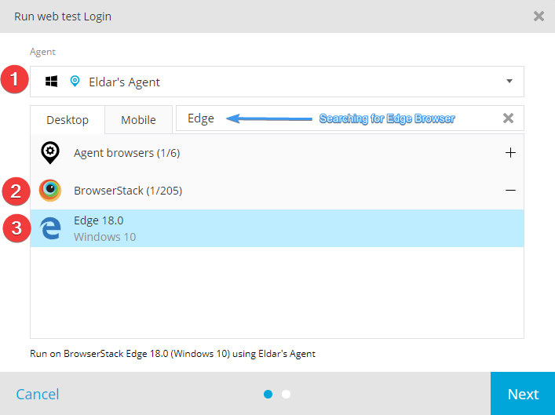
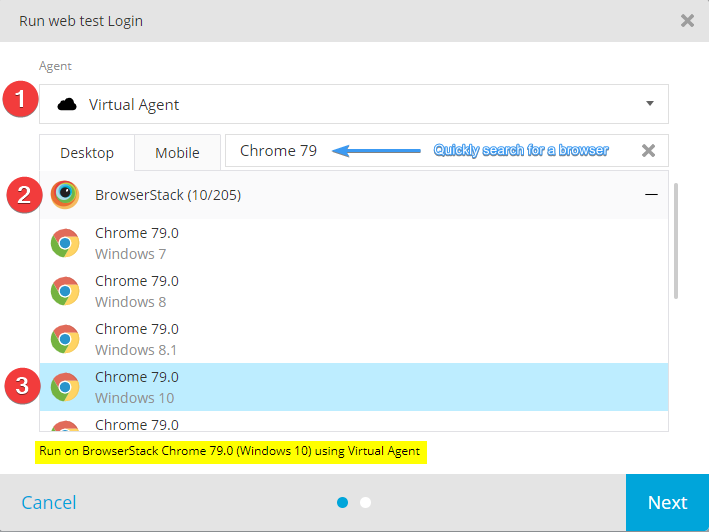
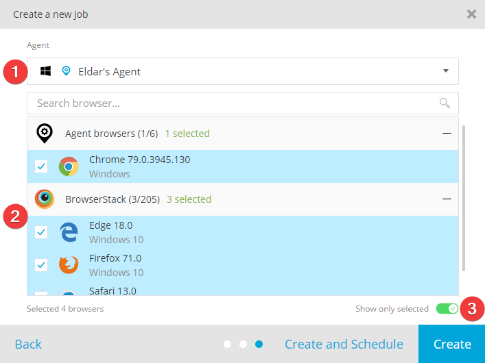
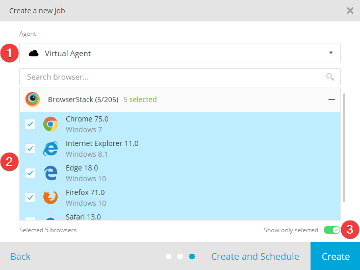
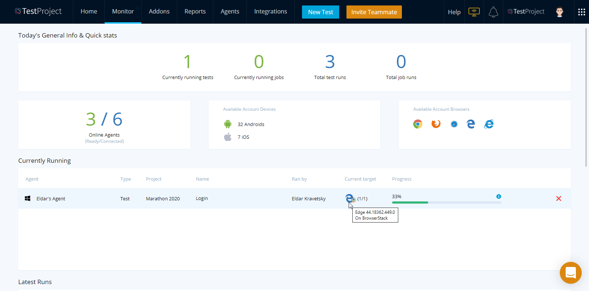
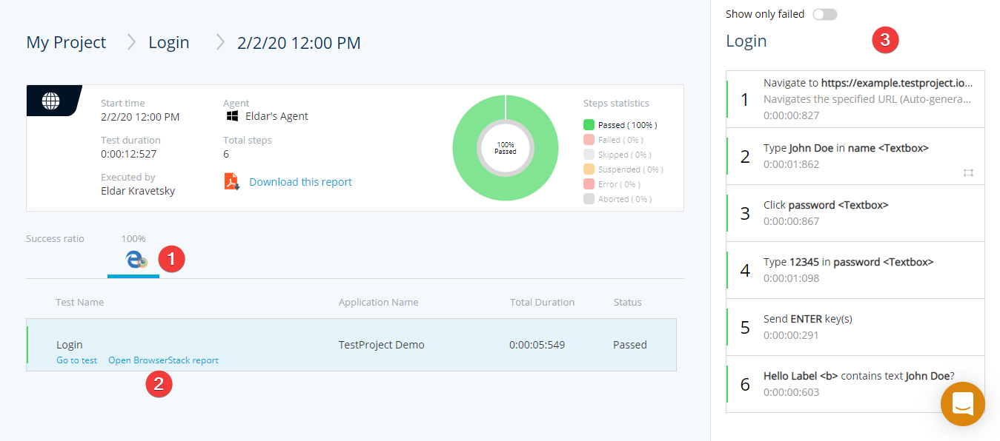
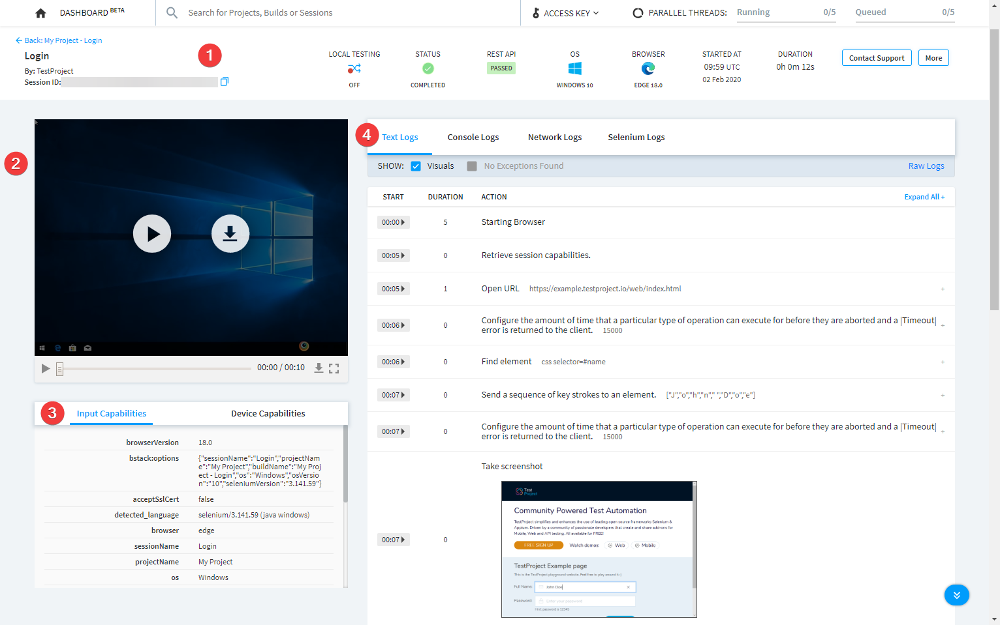

# BrowserStack Integration

## What is BrowserStack?

\*\*\*\*[**BrowserStack** ](https://www.browserstack.com/)is a cloud web and mobile testing platform that enables you to test your websites and mobile applications across on-demand browsers, operating systems and real mobile devices, without requiring users to install or maintain an internal lab of virtual machines, devices or emulators.

Users can choose from more than 1,200 on-demand real mobile devices, browsers and operating systems and rely on a secure, stable and scalable infrastructure to support thousands of concurrent manual and automated tests. By reducing the time, cost and maintenance overhead associated with testing, **BrowserStack** helps teams keep focus on what matters most - building better products and services.

## Why do I need BrowserStack Integration?

Integrating TestProject with BrowserStack allows you and your teammates to run your automation on many different devices and browsers that are provided by the BrowserStack cloud. This means that you can, for example, test your app compatibility on many variations of **Operating Systems - Browser versions - Devices** without having to setup complicated test matrices.

## Setting Up BrowserStack Integration

### Requirements

* [TestProject](https://testproject.io) account - In order to enjoy all the features of the TestProject platform, you will need an active TestProject account. If you don't already have one, you can [sign up](https://app.testproject.io/signup/) for a free forever plan [here](https://app.testproject.io/signup/).
* [**BrowserStack**](https://www.browserstack.com/) account - To utilize BrowserStack cloud you need an account. If you don't already have one, just visit [here](https://www.browserstack.com/users/sign_up) to create a free trial.

### Get BrowserStack Username & Access Key

In order to setup the integration, you will have to obtain a BrowserStack Access key. After logging into your BrowserStack  account, visit the [setting area](https://www.browserstack.com/accounts/settings) \(1-2\) and copy your **User Name \(3\)** and **Access Key \(4\)**.

### Enabling BrowserStack Integration in TestProject


Only account administrators can set up BrowserStack integration.


After you have the BrowserStack **User Name** and **Access Key**, you can proceed with setting up the integration. Go to the [**Integrations** ](https://app.testproject.io/#/integrations)\(1\) section of your TestProject account and click on the **Cloud Execution** \(2\) option on the left hand side menu. Click on the toggle  \(3\) near the BrowserStack logo to enable the integration. You will now see the BrowserStack integration settings window, just paste your **Username** \(4\) and **Access Key** \(5\) in the relevant places and click **Save** \(6\).

Once saved, we will validate that the credentials are correct and close the integration settings window. After the window closes you should see that the integration is active  That's it!


Once you set up the integration you cannot retrieve your access key from TestProject, as it is being stored in an encrypted state. You can always click on the cog icon to change your credentials.


## Utilizing BrowserStack Cloud in TestProject

Now that we're all set up, you can go ahead and start running your tests and jobs on the BrowserStack cloud. Before continuing, let's understand the various options to run your tests.

### Three ways to run your tests

#### Running in your own lab using own Agents

As you probably already know, TestProject allows you to connect infinite number of [agents ](../schedule-and-run-tests/manage-testproject-agents.md)that can run on any operating system and are used to record, develop and run your tests. Using this option means that agents connected to your account are being used to run your tests on:

* Devices that are physically connected to the agent machine.
* Emulators running on the agent machine.
* Browsers that are installed on the agent machine.

In this case you are using your own lab. In practice, when running a test or setting up a job, just choose one of your registered **Agents** \(1\), choose the **Agent browsers** \(2\) section, choose your browser \(3\) or device and run your test.

#### **Running on** BrowserStack **Cloud using own Agents**

Once you have the integration set up, you can use your own TestProject Agents to run tests and jobs on the BrowserStack cloud. This means that your agents \(wherever they are installed\) will be running your tests in the cloud using BrowserStack devices or browsers. To achieve that, choose one of your **Agents \(1\)**, expand the BrowserStack \(2\) section and select a browser \(you can use the search option to quickly find the desired target\) \(3\) or device from the BrowserStack cloud and run your test. That's it!


This method is useful for cases where tests need access to your local resources that are not accessible from the cloud. For example, let's say that in some of your steps you are using the TestProject [RESTful API Client Addon](https://addons.testproject.io/restful-api-client) to access your back office API. You can test your website in the cloud and make your validations internally.


#### Running on BrowserStack Cloud using the Virtual Agent

In addition to the two ways described above, another great option is running entirely in the cloud using the **Virtual Agent**. Once you've set up your BrowserStack integration you will see that a **Virtual Agent** was added to [your lab](https://app.testproject.io/#/agents).

This type of execution does not require an Agent at all. This means that you can execute your tests and jobs even if you do not have any agents that are currently available for execution. To use this capability when running a test, just choose the **Virtual Agent** \(1\), expand the BrowserStack section \(2\), choose the desired browser \(3\) or device and run your test. Because BrowserStack provides many browsers and devices and the list can get long, we've added an easy quick search option that will allow you to filter out all the unnecessary targets.


Note: Virtual Agents can take up to a minute to initialize before starting the execution.


### Defining Jobs to run on BrowserStack Cloud

Now that we understand all the options to run your tests, let's talk about jobs. After you have your tests created, the next logical step is to put all or some of them into a job that can be scheduled or executed from your CI pipeline \(in addition to just clicking the **play** button\). 

When creating a new job or editing an existing one, you have the option to define it to run using any of the three methods mentioned above. Jobs can be defined to run on multiple browsers or devices and therefore after selecting an **Agent** \(1\), just choose on which browsers \(2\) or devices to run the job. If you select one of your own agents \(like in the image below\), you will be able to select both local browsers or devices \(that are installed on or connected to that agent's machine\) and/or BrowserStack browsers or devices. 


You can toggle the **Show only selected** \(3\) option to conveniently see all the selected targets.


Once the jobs is triggered, the Agent will run all of your tests on each of the selected browsers or devices. If you choose to assign the **Virtual Agent** to the job \(instead of selecting one of your own agents\), no physical agents are required to be available when the job is executed.


When using the **Virtual Agent**, local browsers / devices are not displayed. Meaning that only BrowserStack browsers and devices will be available. 


## Reviewing the Progress & the Results of my Execution

After we've successfully defined our integration and ran our tests on various targets using all the different methods \(or just one\), it is time to see if everything that we've tested performed as expected or if there are some issues in the tested applications that need to be investigated and dealt with. TestProject has provided great test run reports since day one and this has not changed. When you choose to use the BrowserStack cloud to run your TestProject tests, you get double the data!

### Real-time Progress

First of all, when tests or jobs are executed on the BrowserStack cloud, you can see the progress in the [TestProject Monitor](https://app.testproject.io/#/monitor) with some additional information about the executed test or job.


While in the Monitor, notice that the browser has a BrowserStack icon over it, indicating that it is running in the BrowserStack cloud. Hovering over the browser icon will show the exact version of the used browser.


In addition to that, if you open your [BrowserStack Dashboard](https://automate.browserstack.com/dashboard/v2), you can see the execution happens in real time. If you are running a mobile test you can see what's happening in the [BrowserStack App Dashboard](https://app-automate.browserstack.com/dashboard/v2).

### Execution Reports

Once your execution has finished, you can hop over to the [Reports ](https://app.testproject.io/#/reports)section in your TestProject account to see the results of your test\(s\). As you are already used to, all the information is here with some additional elements. You can see that the browser \(1\) has the BrowserStack logo on it \(just like in the Monitor\) which indicates that the execution was performed on a BrowserStack browser. Hovering with your mouse on the browser icon will show the exact used version. On the right hand side \(3\), you can still see all the steps of your test with all the information that you are used to seeing there, including full screenshots. Besides that, all of the tests of your job will have a link \(2\) that will take you directly to the related execution session in the BrowserStack Dashboard.

Once you click the **Open BrowserStack report** link, you will be redirected to BrowserStack where you will be able to see some additional information about that execution: 

1. Basic information about the execution \(Name, Time, OS, Browser, Device, etc.\).
2. A video recording of the execution itself.
3. Driver capabilities that were used for the execution.
4. The exact Selenium / Appium commands that were executed and other logs.

## Some Additional Information

* This document uses web test examples that are executed on various browsers, but it is important to state that Android and iOS tests and jobs can be as easily executed on the BrowserStack cloud as well.
* When executing mobile tests, please make sure that the tested applications are defined in TestProject with an attached file. This is due to the fact that BrowserStack cloud needs access to the application file in order to install it on the chosen device before running the test. The architecture of the attached application must be compatible with the device\(s\) that it will be installed on during the tests.

## Conclusions

As you can see, this integration is a powerful TestProject feature that can take the quality of your software to the next level! Use it to make sure your applications run smoothly on many devices and browsers, without the need to own and maintain a lot of devices and browser types and versions.

The **Virtual Agent** capability eliminates the need to have multiple Agents that are constantly up and ready to run your tests. You can effortlessly execute many tests and jobs at the same time to shorten your automation testing cycles.

