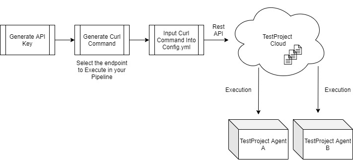
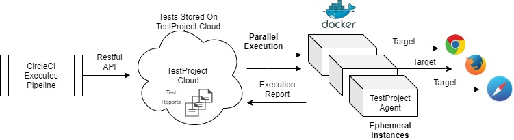
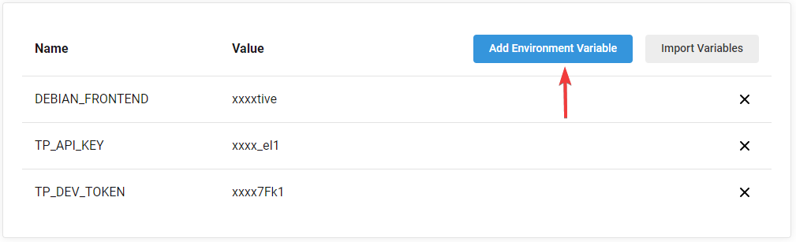
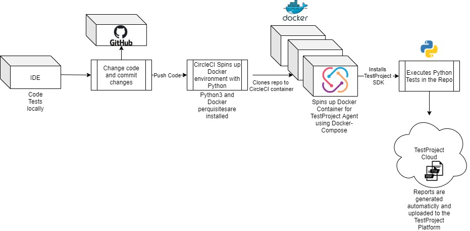
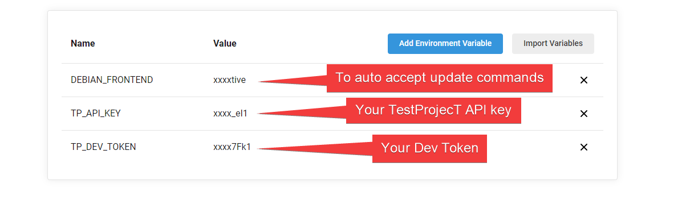
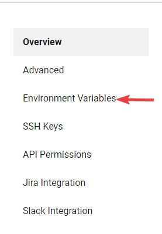
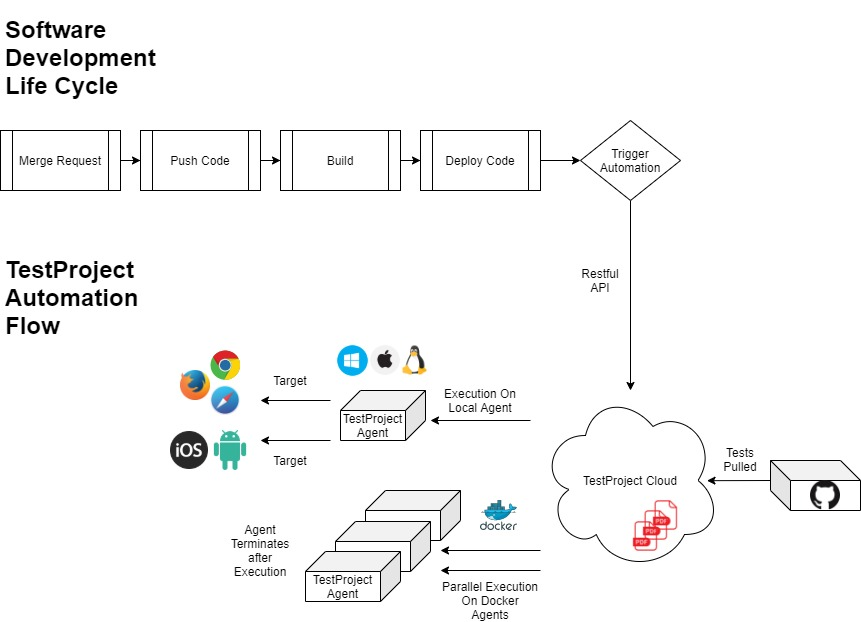
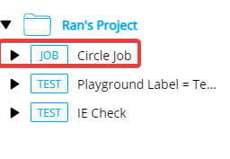
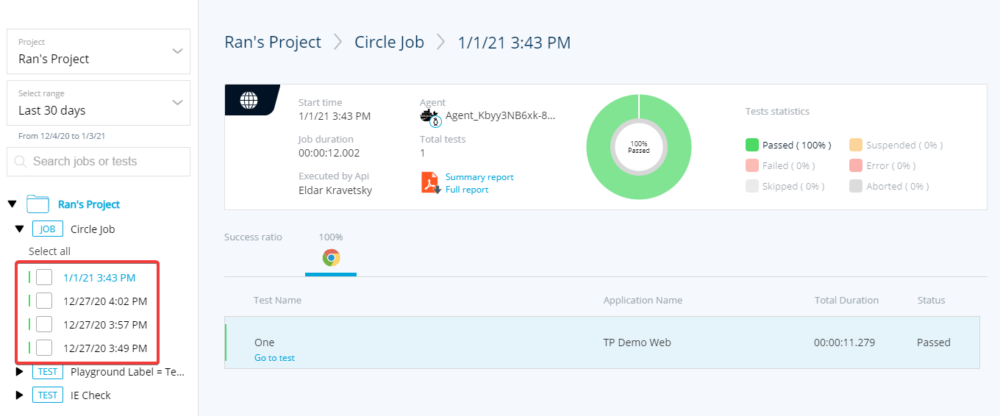

# CircleCI Integration

## **Background:**

This tutorial explains how to integrate TestProject with CircleCI CI/CD pipeline with the following scenarios

1. Running TestProject recorded tests with CircleCI CI/CD Pipelines
2. Running TestProject coded python tests with CircleCI CI/CD Pipelines
3. Running TestProject coded Java tests with CircleCI CI/CD Pipelines

## **Running TestProject recorded tests with CircleCI CI/CD Pipelines**

Today’s development cycles include fast releases and require agile testing methods, developers and testers need to collaborate to release tested features faster. Integration of test automation within the software CI/CD plays a significant with agile development cycle and better software to be released to production faster.

TestProject cloud offers seamless integration with any CI/CD flow by using its Restful API which allows performing numerous operations, as well as execute Tests on-premise and on remote agents, both ad hoc and permanent agents,.

Below is a diagram that explains high-level TestProject architecture and the prerequisites needed for CI/CD :



**Getting Started With TestProject API:**

1. You need to create an API Key from here: [https://app.testproject.io/\#/integrations/api](https://app.testproject.io/#/integrations/api)
2. Generate your API key: [here](https://app.testproject.io/#/integrations/api), and copy it.
3. Go to the API documentation: [here](https://api.testproject.io/docs/v2/#/)
4. Click on the Authorize button and paste your API key and click on Authorize.


By using TestProject Restful API, we will create a curl command that will execute the desired recorded tests using a CURL command in the Pipeline.

**Generating the Curl Command**

In the API Swagger, we will scroll down to the Endpoint we wish, in this example we will use the **Run Job Endpoint** which can be found [here](https://api.testproject.io/docs/v2/#/Jobs/Jobs_RunJobAsync).

With this Endpoint, we can execute a Test on any registered agent in the account associated with our API key.

All values that are passed in the body of this request will override the **DEFAULT** job values

In this example, we will run a Recorded Web test on Chrome using the Run Job endpoint.

**Setting up the Endpoint:**

**In the “Run” Job endpoint, click on ‘Try It Out’**


We will insert the Project ID:


And the Job ID:


Next, we can edit the body of the request, here we can insert values that will override the default job values on runtime.

To just run the Job as is, with the default values, you can just keep the body empty like so:


In our example, we will edit the values of the body to override default values from the Job.

We will override the default params **username** and **password** in the test with custom values.

The job will have two tests, both have two parameters in them called **username** and **password**.

We will override those parameters on runtime using the **testParameters** JSON which we pass in the **body** of the request.

This is how the parameters are defined in the tests:


**This is how we override them using the request body**:


We will now generate the CURL command by pressing Execute:


And we will see the CURL command generated:


This is the curl command we will be used in our pipeline.

Now we can set up our pipeline using the above command to execute the Job every time we push a new change to the defined branch.

**Setting up the Pipeline in CircleCI on a Permanent Agent**

1. In your Dashboard, add a Project, this will be the project which will have the pipeline, once we push a new change to this project, we will execute the pipeline.


2.     Select the project


3.   In the following window, we will have the option to choose pre-configured YAML files for our pipeline, in this example, I will select the Python file.

4.   Paste the curl command in the proper step.


   5.   Click on **Commit and Run** to configure the pipeline in the selected branch

Now every time we push a change to the selected branch, the Pipeline will trigger the Curl command which in the following will trigger the tests.

**A Complete example of a pipeline config.yml**

```text
version: 2.1
orbs:
  python: circleci/python@0.2.1
jobs:
  build-env:
    executor: python/default
    steps:
      - checkout
  run-recorded-tests:
    executor: python/default
    steps:
     - run:
          command: curl -X POST "Request URL"  -H "accept:application/json"  -H "Authorization:YOUR API KEY" -H "Content-Type:application/json" -d "{'testParameters': [{'data': [{'username': 'TestProject','passowrd': $PASSWORD}]}]}"
          name: Run Test On Build
workflows:
  main:
    jobs:
      - build-env
      - run-recorded-tests
```

You can view the pipeline execution in the Dashboard:


**Running TestProject recorded tests with CircleCI CI/CD Pipelines using Docker Ephemeral Agent**

In the previous example, we saw how to execute tests on a permanent agent by supplying a Job ID and API key. This example will explain how to execute Web tests on Docker agents, which will allow you to spin up agents on demand. We will utilize docker-compose to create agents on the fly for a specific job to run and terminate them afterward.

It will also allow you to execute multiple tests in Parallel within your pipeline.

Below is a diagram on the flow of the process:



First, we will need to config the correct environment variables.

**Configuring Environment Variables in CircleCI:**

The following config below uses these Environment variables:


You can set them in CircleCI Dashboard:

1. Go to project settings:


2.  Click on Environment Variables:


3.  Add Environment Variable:



**Configuring Docker Compose YML file**

You will need a docker-compose.yml file that will spin up the Docker agent.

In this example we are overriding the **username**/**password** parameters that are used in the tests by using this YAML file:

```text
version: "3.1"
services:
  testproject-agent:
    image: testproject/agent:latest
    container_name: testproject-agent
    depends_on:
      - chrome
      - firefox
    environment:
      TP_AGENT_TEMP: "true"
      TP_API_KEY: $TP_API_KEY
      TP_JOB_ID: $TP_JOB_ID
      TP_JOB_PARAMS: '"jobParameters" : {"browsers": [ "chrome", "firefox" ],  "testParameters": [{"data": [{"username":"TestProject", "password":$PASSWORD}]}]}'
      CHROME: "chrome:4444"
      FIREFOX: "firefox:4444"
    ports:
      - "8888:8589"
  chrome:
    image: selenium/standalone-chrome
    volumes:
      - /dev/shm:/dev/shm
  firefox:
    image: selenium/standalone-firefox
    volumes:
      - /dev/shm:/dev/shm

```

Using the above compose file, we will spin a docker agent which will execute the Job stated in $**TP\_JOB\_ID**.

The variable **TP\_JOB\_PARAMS** holds the JSON which holds the username and password parameters that will be overridden in runtime.

Using [this](https://github.com/Rantzur1992/recorded_example/blob/main/.circleci/config.yml) config in the pipeline to execute the Job on the Docker agent.

```text
version: 2.1
jobs:
  run-recorded-tests:
    machine:
      image: ubuntu-2004:202010-01
    steps:
      - checkout
      - run:
          name: Run tests
          command:  |
              set -x
              docker-compose up --abort-on-container-exit

workflows:
  main:
    jobs:
      - run-recorded-tests

```

You can read more on TestProject Docker agent [here](https://hub.docker.com/r/testproject/agent).

## **Running TestProject coded Python tests with CircleCI CI/CD Pipelines**

Using TestProject Python SDK, you can seamlessly integrate existing/new Python code to your Pipeline.

With a simple process, you will be able to run your tests with every new change that is pushed and enjoy Cloud and Local reports directly to your TestProject account.

Below is a diagram on the flow of the process:



Before integrating your coded tests with CircleCI, we need to make sure you are using our Python SDK.

1. Navigate to [https://app.testproject.io/\#/integrations/sdk](https://app.testproject.io/#/integrations/sdk)
2. Download the Python SDK using **pip3 install testproject-python-sdk**
3. Copy the Developer Token, which we can later use in our Python code.
4. You can read more in the Python SDK repository: [https://github.com/testproject-io/python-sdk](https://github.com/testproject-io/python-sdk)

Once we have set up our code, we can integrate our coded python test using CircleCI.

In CircleCI, open a new project like shown previously, and select the Project for your coded test.

Like previously, we will select a pre-configured Python yml file, and configure it to run our Tests.

Here is a complete example of a config.yml that does the following:

1. Creates a clean ubuntu 20.04 environment.
2. Spins up docker container using docker-compose from a public example’s repo from TestProject.
3. Runs the Example python tests on the Docker Agent using Pytest.

**`Note: When using Docker Agent on CircleCI, you must use Machine config and Not Docker Executor.`**

**Config.yml:**

```text
version: 2
jobs:
  build:
    machine:
      image: ubuntu-2004:202010-01
    steps:
      - checkout
      - run:
          name: Install Requirements
          command:  pip3 install -r requirements.txt

      - run:
          name: Start Agent and wait for agent to register
          command: |
              set -x
              docker-compose up -d
              trap 'kill $(jobs -p)' EXIT
              attempt_counter=0
              max_attempts=45
              mkdir -p build/reports/agent
              docker-compose -f docker-compose.yml logs -f | tee build/reports/agent/log.txt&
              until curl -s http://localhost:8585/api/status | jq '.registered' | grep true; do
                if [ ${attempt_counter} -eq ${max_attempts} ]; then
                  echo "Agent failed to register. Terminating..."
                  exit 1
                fi
                attempt_counter=$(($attempt_counter+1))
                sleep 1
              done

      - run:
          name: Run Tests
          command:  pytest python_example.py

```

The following config above uses these environment variables:



You can set them in CircleCI Dashboard:

1. Go to project settings:


2.   Click on Environment Variables:



3.   Add Environment Variable:


Now you are good to go running your Python Coded tests using TestProject SDK in your pipeline.


## **Running TestProject coded Java tests with CircleCI CI/CD Pipelines**

Integrating your Coded Java tests is very similar to Integrating Python tests like shown above.

You need the save Environment variables, just need to change the config.yml to work with your Java environment.

We will use Gradle in this example.

First, we set up our **build.gradle** to point to the classes which hold our tests.

In this simple example, we will use one class called JavaExample which holds the test using JUNIT, and we will be using Gradle wrapper\(gradlew\) to execute the tests.

Example of **build.gradle:**

```text
plugins {
    id 'java'
}

group 'testproject.io'
version '1.0-SNAPSHOT'

repositories {
    mavenCentral()
}

test {
    useJUnit()
}

dependencies {
    implementation 'junit:junit:4.12'
    testImplementation group: 'junit', name: 'junit', version: '4.12'
    implementation 'io.testproject:java-sdk:0.65.0-RELEASE'
    testCompile group: 'org.junit.jupiter', name: 'junit-jupiter-engine', version: '5.7.0'

}

```

**The config.yml**:

```text
version: 2
jobs:
  build:
    machine:
      image: ubuntu-2004:202010-01
    steps:
      - checkout
      - run:
          name: Update Dependencies And Install Java 11
          command:  |
              sudo apt-get -y update
              sudo apt install -y openjdk-11-jdk
              java -version

      - run:
          name: Build the code
          command:  |
              chmod +x gradlew
              ./gradlew build -x test
            
      - run:
          name: Start Agent and Wait for agent to register
          command: |
              set -x
              docker-compose up -d
              trap 'kill $(jobs -p)' EXIT
              attempt_counter=0
              max_attempts=45
              mkdir -p build/reports/agent
              docker-compose -f docker-compose.yml logs -f | tee build/reports/agent/log.txt&
              until curl -s http://localhost:8585/api/status | jq '.registered' | grep true; do
                if [ ${attempt_counter} -eq ${max_attempts} ]; then
                  echo "Agent failed to register. Terminating..."
                  exit 1
                fi
                attempt_counter=$(($attempt_counter+1))
                sleep 1
              done

      # run tests
      - run:
          name: Run Test
          command: ./gradlew test

```

This pipeline will install **JDK 11** which is required by the TestProject SDK, install Gradle, Start the docker agent, and execute the test.


**Summary Diagram**

For summary, the following diagram shows the flow from development to automation execution from TestProject:



## **View Execution Reports**

After execution, we can view the Reports in the Reports page.

In your TestProject account click on **Reports**


Here we can see all of our Execution reports, find the Job



Expanding it will show all previous execution under that Job.



We can also download the PDF reports to see the full detailed report with screenshots.

**All examples can be found on our** [**GitHub**](https://github.com/testproject-io/circle-ci/tree/main)**.**

