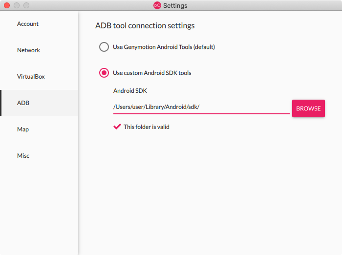

# Genymotion Desktop Integration

## What is Genymotion Desktop?

Genymotion Desktop is an Android emulator with over 3000 configurations. 

## Why do I need Genymotion Desktop Integration?

Integrating TestProject with Genymotion Desktop allows you to run your automation on many different emulators. This means that you can, for example, test your app compatibility on many variations without having to purchase any devices.

## Setting Genymotion Desktop Integration

In order for the TestProject Agent to "see" the Emulators, both TestProject Agent and Genymotion Desktop, should use the same ADB server. To configure it, open Genymotion Desktop configuration preferences, and update the ADB Setting to use a custom Android SDK tools.

It can be either Android SDK tools installed in your operating system, or those bundled with the Agent, for example in macOS, having the Android SDK installed under user's `<user>` home folder, inside Library, the configuration should be set as following:

Default Android SDK location in Windows is:

`C:\Users\<user>\AppData\Local\Android\sdk`

While `<user>` is the username of the person logged in to Windows.

## TestProject Agent Bundled ADB - Locations

Default locations for bundled ADB are as following:

* Windows - C:\Program Files\TestProject Agent\android-sdk
* macOS - /Applications/TestProject Agent.app/Contents/Resources/android-sdk
* Linux - ~/testproject/agent/android-sdk

