# GitHub Integration

## GitHub Integration With TestProject

GitHub is a version control platform that allows you to track your code, manage your work in different branches and environments and store different versions of your code.

With the [TestProject](https://testproject.io) integration with GitHub, your synchronized projects are stored as repositories with all of their tests in them. Each change that you make in your test, is automatically stored and documented and you can easily keep track of your progress.

## Prerequisites

In order to use this GitHub integration, you need to have: 

1. An active TestProject account can be created for free at [https://testproject.io](https://testproject.io). 
2. An active [GitHub account](https://github.com/). 
3. GitHub personal access token which can be obtained [here](https://github.com/settings/tokens).

## Set the integration

### How to create a personal access token in GitHub

Go to the personal access token page in your [GitHub settings](https://github.com/settings/tokens).

Click on "Generate new token".

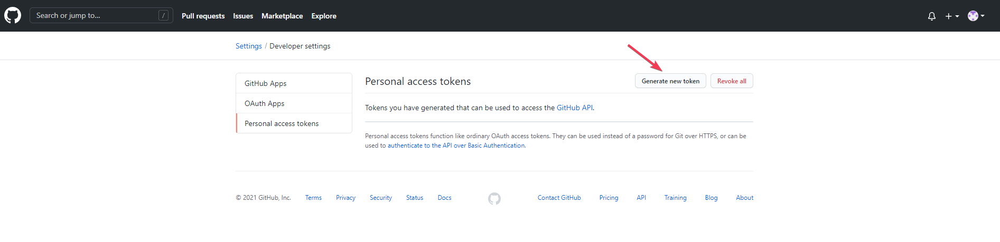

Pick a name for your token and check the "repo" checkbox.

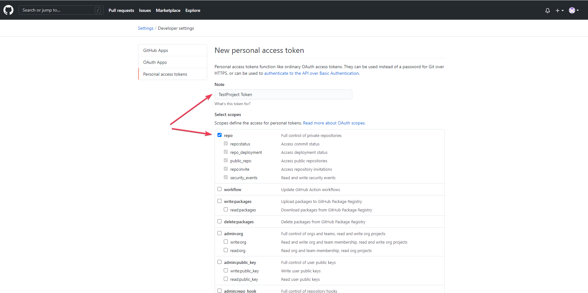

Scroll down to the bottom of the page and click on the "Generate token" button.

That's it! You now have a personal access token ready to use. Copy the token and go to [TestProject](https://testproject.io).

### Create the GitHub integration in TestProject

Navigate to the [Git Integration](https://app.testproject.io/#/integrations/git) page in TestProject and click on the GitHub toggle.

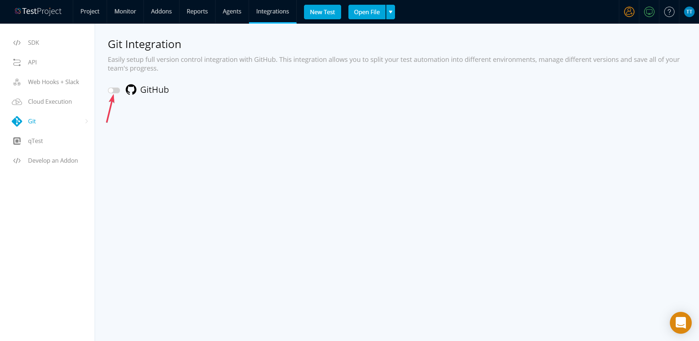

Enter your organization/username and your access key and click "Next".

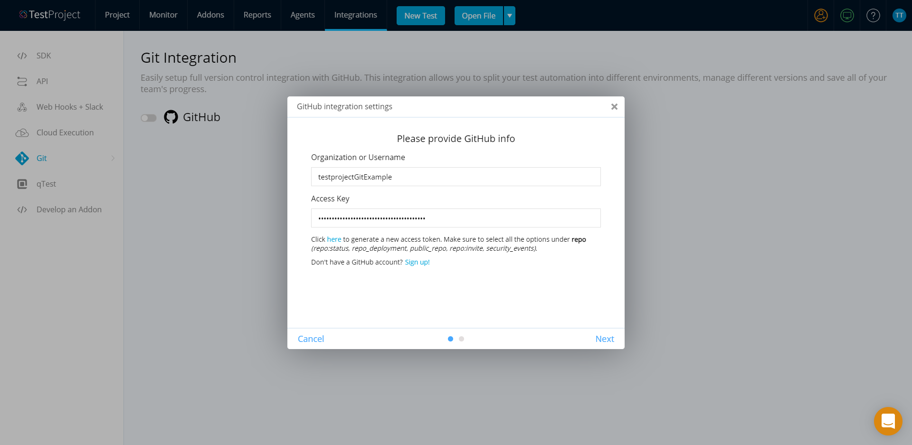

Select the projects that you want to synchronize with GitHub and click the "Save" button to create the integration.

That's it! The projects that you've selected are now synchronized with GitHub

### Edit the GitHub integration in TestProject

To start/stop syncing a project with GitHub, you can always go back to the [Git Integration](https://app.testproject.io/#/integrations/git) page in TestProject and edit the integration:

Navigate to the [Git Integration](https://app.testproject.io/#/integrations/git) page in TestProject and click on the Settings icon

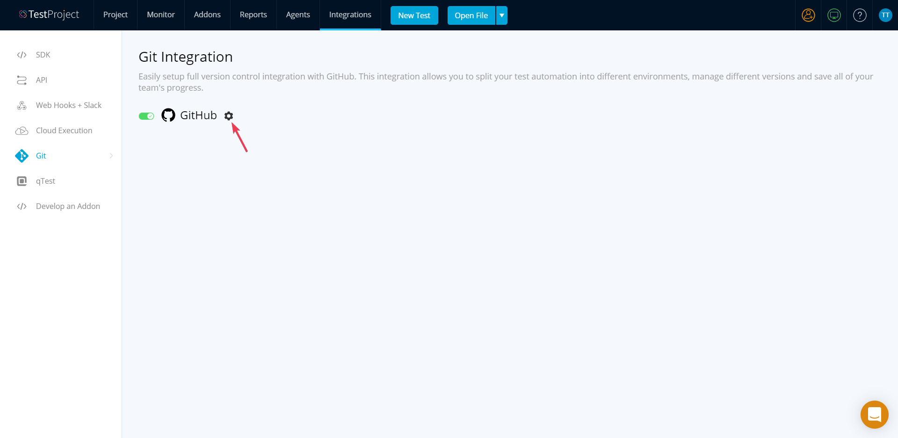

Edit the organization/username and the access key and click on the "Next" button. If you only want to edit the synced projects, just click on the "Next" button.

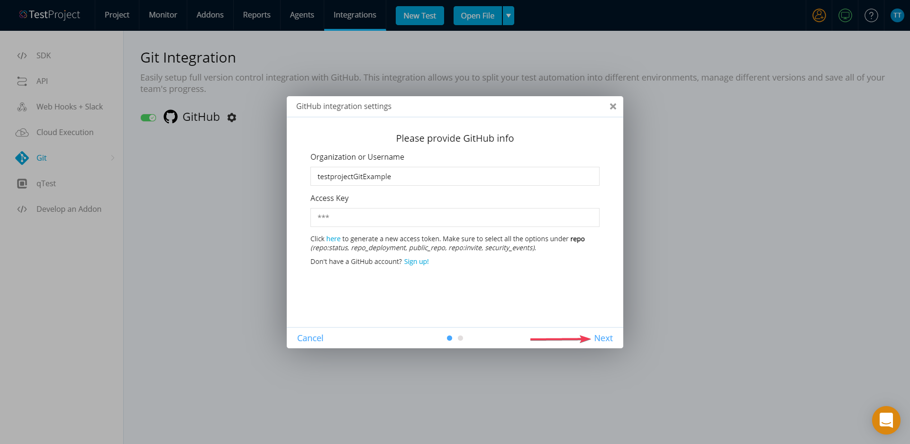

Select the projects that you want to sync with GitHub and click "Save". Make sure to include all the projects that you want to sync. Projects that are currently synced and are not included in the list, will not be synced anymore.

### Indication for a synced project

Once you set a GitHub integration and synced a project, you will see a blue git icon that indicates that this current project is synced with GitHub. All the tests inside this project are automatically synced as well and every change that you make will be committed in GitHub.

A project is represented as a repository in GitHub and inside this repository, you will find the project's tests.

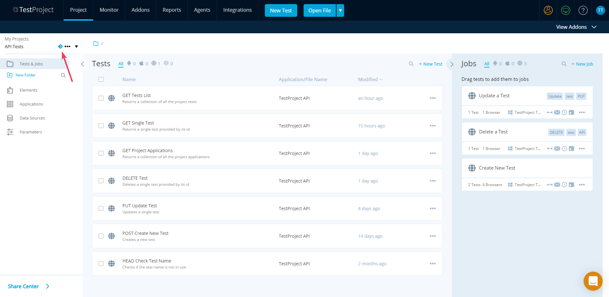

### Start/stop a single project synchronization

If you want to start/stop syncing a single project, you can always do it by clicking on the project menu from the projects drop list.

Click on the project's menu from the projects drop list

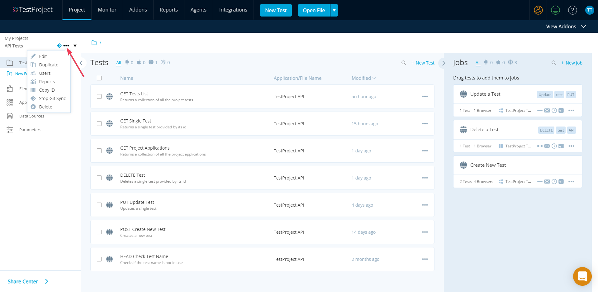

If the project is already synced, you will find a "Stop Git Sync" option. Click on this option to stop syncing this project with GitHub.

If the project is not synced with GitHub, you will find a "Sync With Git" option. Click on this option to start syncing this project with GitHub.

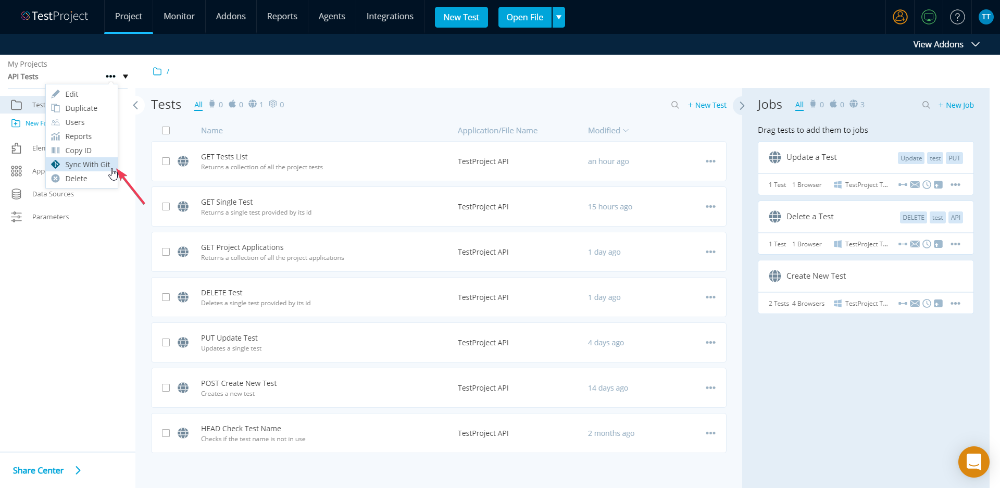

### View test history

For each synchronized test, there's a full history that includes all the changes of this test. Each change is documented as a commit with a timestamp, commit message and commit hash.

Inside the test history window, you can view all the commits for this test, open a specific commit in GitHub and even download a specific version of the test by selecting a specific commit.

To view the test history, follow these steps:

Click on the test's menu of the test that you want to see its history.

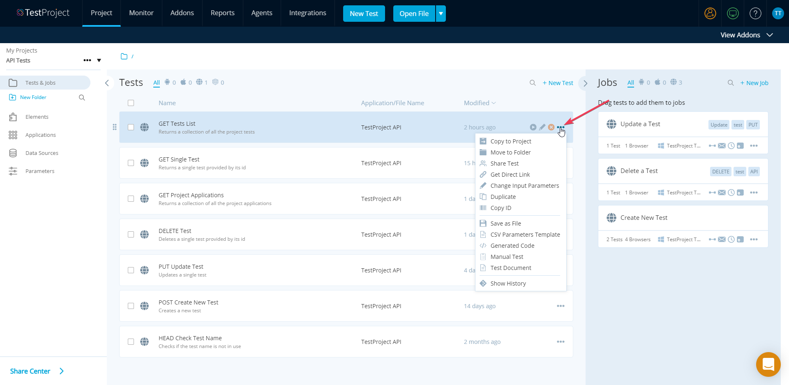

Click on the "Show History" option in the test's menu.

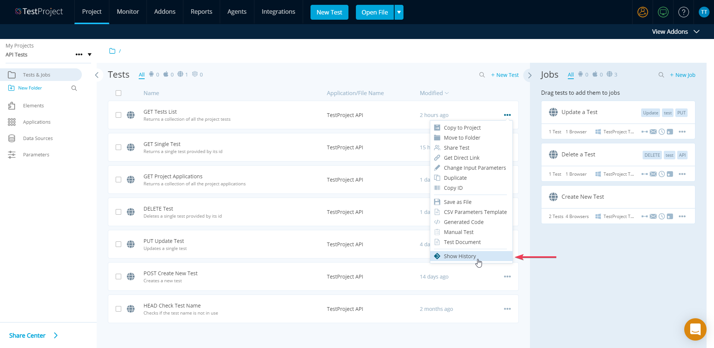

#### Test history window

`Open commit in GitHub` - Click on the commit hash to open the commit in GitHub.

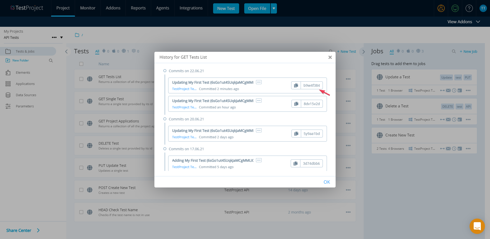

`Copy commit hash` - If you want to copy the full commit hash, click on the copy icon.

`See full commit details` - Click on the three-dots icon to expand the commit and view its full details.

`Download the test` - By clicking on the download button, you can download a specific test version based on the selected commit. The test will be downloaded as a `.yaml` file. It can be then executed using [TestProject CLI](https://docs.testproject.io/testproject-agents/testproject-agent-cli) or re-imported into TestProject to become a recorded test.

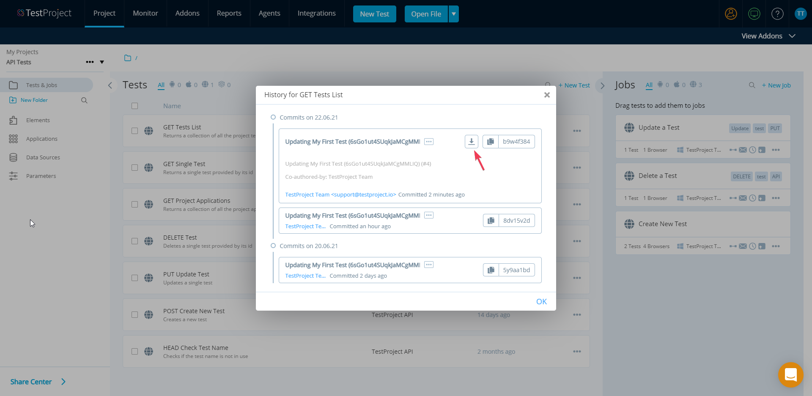

`Import test from selected commit` - The import option allows you to retrieve a specific version of your test into TestProject. The imported test will be automatically added to the current project as a new test. The short commit hash will be appended to the name of the imported test.

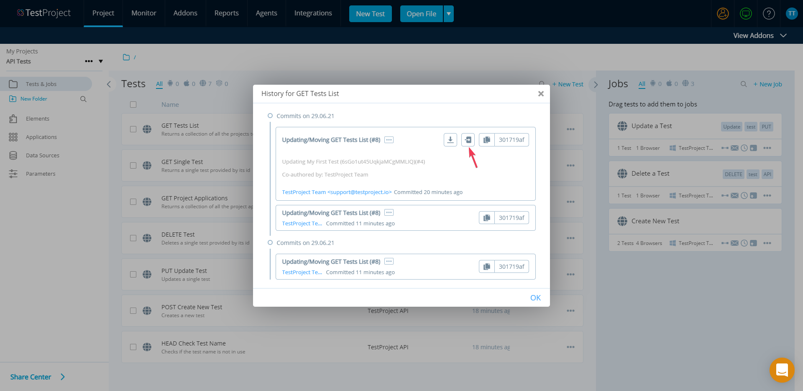


Please note that only recorded tests are being synchronized. Coded tests will not appear in your GitHub repositories.


