# Jenkins Integration

The [TestProject plugin for Jenkins](https://plugins.jenkins.io/testproject) provides an easy way to execute TestProject jobs, update applications, data sources, project parameters, test packages, generate a configuration for the TestProject Agent and more. The plugin supports both **FreeStyle** and **Pipeline** jobs.

## **Prerequisites**

In order to use this plugin, you **must** have:

1. An active **TestProject account** which can be created for free at [https://testproject.io](https://testproject.io).
2. At least one registered and running [**TestProject Agent**](https://docs.testproject.io/testproject-agents/what-is-a-testproject-agent).
3. An **API key** as explained in [getting started with using the TestProject API](https://docs.testproject.io/api/getting-started-with-using-the-testproject-api).

## Installing TestProject Jenkins Plugin

[TestProject’s Jenkins plugin](https://plugins.jenkins.io/testproject) is available in the Jenkins plugin index. In order to install it, login to your Jenkins server and choose **Manage Jenkins** → **Manage Plugin → Available**. in the filter field type** “TestProject” **and then select the TestProject plugin and hit **Install without Restart**.

That’s it! After a few seconds, the plugin will be installed in your Jenkins server.


## Creating a TestProject API Key

In order to integrate with TestProject, you will need an API key that your Jenkins server will use to trigger your automation jobs.  If you have not yet created a key, you can follow the steps in [getting started with using the TestProject API](../api/getting-started-with-using-the-testproject-api.md). After the new API key has been created, copy it and head back to your Jenkins server.

## Configuring the TestProject Jenkins Plugin

Next you will need to configure the TestProject Jenkins plugin and set the newly created API key. This is a one-time step (unless you wish to change your key at some point)

* In Jenkins, choose **Manage Jenkins** → **Configure System.**
* Locate the **TestProject **configuration section, paste your key into the **API Key** field and hit **Save**.

You can tick the "**Verbose**" checkbox to receive more detailed reports in your build’s console output. After completing these steps, you will be all set for using the TestProject Jenkins plugin.


## Freestyle Jenkins Projects

After installing the TestProject Jenkins plugin, generating an API key and configuring it to be used by Jenkins, you can start to incorporate your automated tests in the CI process. The plugin supports two of the most popular approaches: Freestyle & Pipeline.

Let's start with Freestyle! First, create a **New Item**:

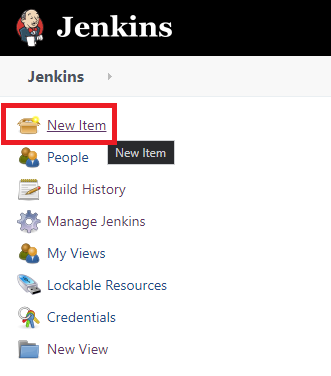

Then, simply select "**Freestyle project**" and enter a name:

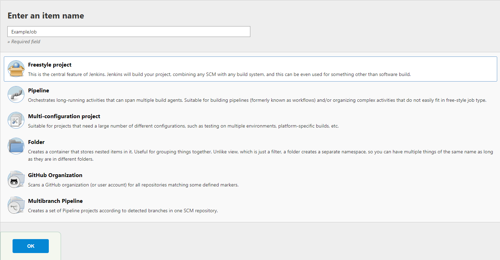

In order to use the TestProject plugin, **add a build step**. Then you will be able to see all the steps the plugin provides:

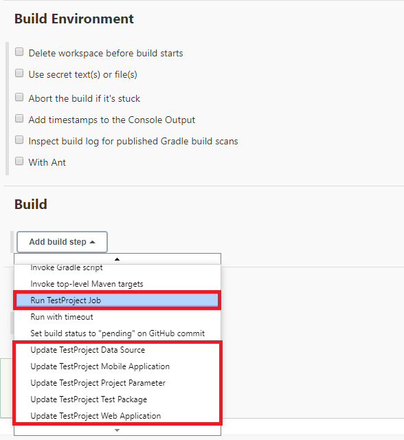

Now, let's have a look at a couple of examples!

### Run TestProject Job

As implied by the name, this step will **execute a job** you have created on the TestProject platform in a project that your **API key has access to**.

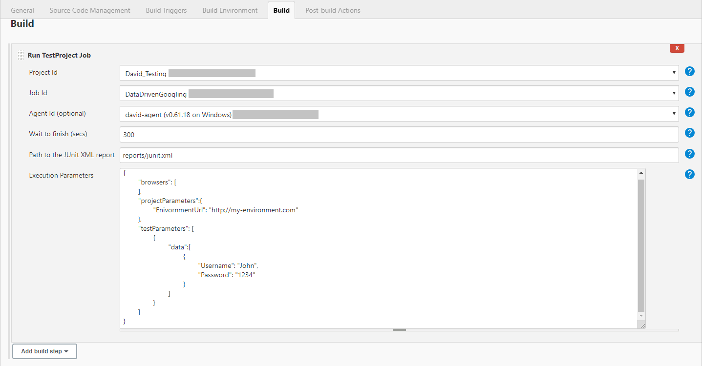


You will need to select a **Project Id** and a **Job Id**. When selecting, you will be prompted with a dropdown list of the projects that are available to your API key and the jobs in the selected project.

The **Agent Id** is an **optional** choice you can set. The **default will use the agent you have configured your job with when creating it through the platform.** However, you can overwrite this selection from here by selecting one of the other agents available to you.

The **Wait to finish** parameter will set the amount of time the build will wait for a job’s execution to finish within the defined time frame. If the** **automation doesn't finish running in the defined period or the TestProject job execution fails,** **the Jenkins build will be marked as failed, however the following build steps will continue.

**If** **you do not want to wait for the TestProject job to finish**, set it to 0, causing the build to continue normally even if the TestProject job fails. This means that the result of the TestProject job will not affect the result of the Jenkins build.

The **Path to the Junit XML report** will create an XML format file containing the results needed for the **JUnit plugin**, it will be created **relative to your Jenkins workspace**. This will be explained in more detail in the JUnit section below.

The final parameter is the **Execution parameters**, you can fill in extra parameters and specifications, the syntax is the same as using the TestProject API. You can find more about that in our [API documentation](https://api.testproject.io/docs/v2/).

### Update Data Source

This build step is used to update one of the data sources files you have stored in your project.

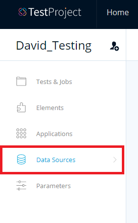

The parameters are the Project Id, the Data Source Id and the path to the updated file. Once again, the Id’s will be available to you in a dropdown list after configuring your API key at the set-up stage.

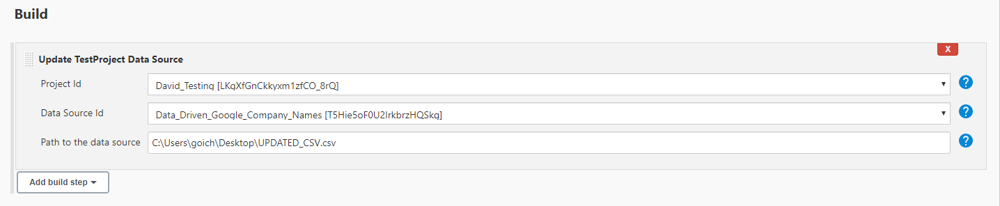

### Update Web Application

You can override test execution parameters such as URL’s as part of your CI/CD job/pipeline by using one of the available build steps in the TestProject plugin. You can use the same job and adjust your job or pipeline to a different environment dynamically.&#x20;

In the following example you will see the web application URL changing before triggering the job, causing the TestProject job to run on the new URL instead:

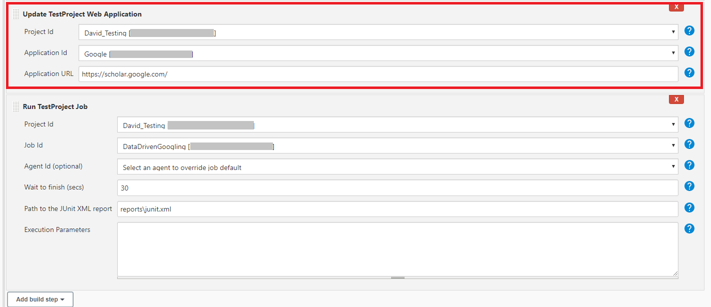

The following build steps:

* **Update TestProject Mobile Application**
* **Update TestProject Project Parameter**
* **Update TestProject Test Package**

Will allow you to similarly **update mobile application APK/IPA files, project level parameters and uploaded coded test packages** dynamically during your CI/CD jobs and pipelines as seen in the examples above.

## Pipeline Jenkins Projects

You can create a new pipeline the same way you created the Freestyle job above, by simply selecting the pipeline option after creating a new Jenkins item.&#x20;

For running a TestProject job through a pipeline, use the following syntax:

`tpJobRun jobId: 'YOUR_JOB_ID', projectId: 'YOUR_PROJECT_ID', waitJobFinishSeconds: 1800`

You will need to **input the value of your project and job Id**, along with the **wait to finish time** parameter, behaving the same way as in the Freestyle job.&#x20;

You can enter **Pipeline Syntax** to help you generate the groovy commands needed to execute the TestProject plugin using your pipeline:

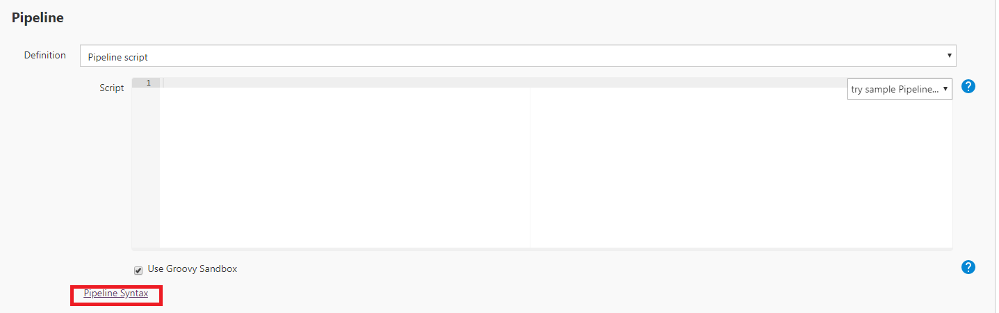

There, you can use the **Snippet Generator** to create the commands.


Note that all TestProject commands start with tp as seen here:


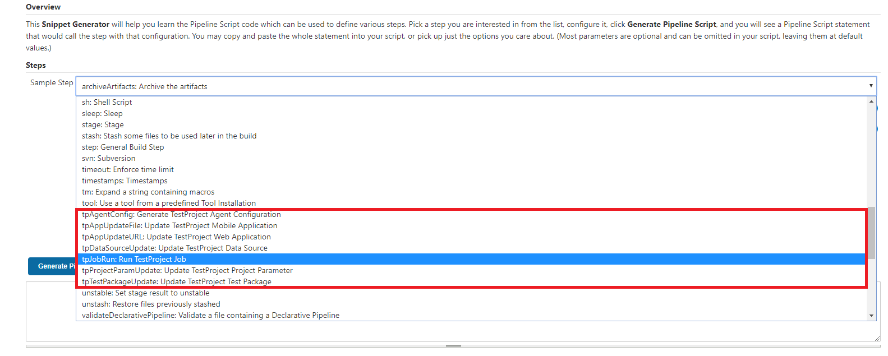


In the pipeline, there is an additional command that is not available in the Freestyle job. The **“Generate Agent Configuration”** command, that handles configuring the [TestProject Agent in Docker](https://docs.testproject.io/testproject-agents/testproject-agent-in-docker). You can find more details about this command in our API documentation [here](https://api.testproject.io/docs/v2/#/Agents/Agents\_GenerateAgentConfigAsync).

The following snippet generator example will generate the command for running a specific job:

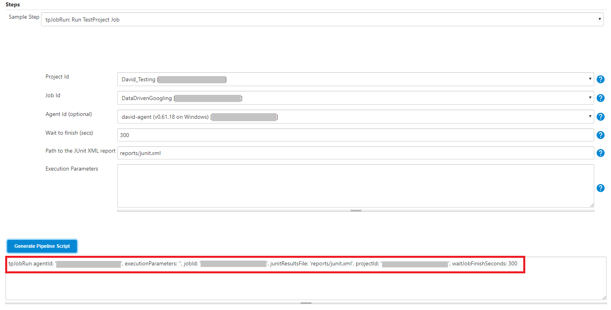

The following pipeline example will execute a TestProject job and create a JUnit report using the pipeline:

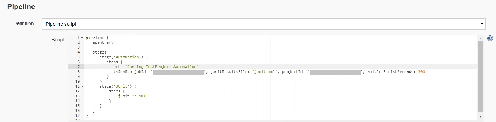

## Reviewing Execution Results

After the execution completes, you will see console entries regarding the execution process. The console output will contain a direct link to your execution report in the platform once done waiting for the job execution to finish:

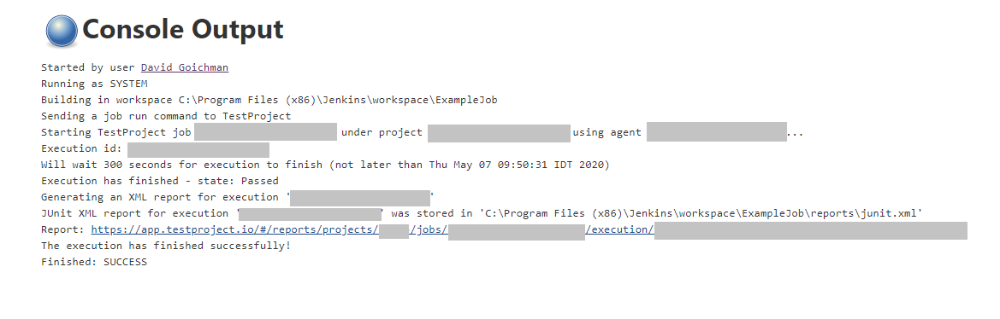


Note that the report link will not be available through the console output if you do not wait for the job’s execution to finish. However, you will still be able to find the report through the [report section](https://app.testproject.io/#/reports) in your TestProject account:


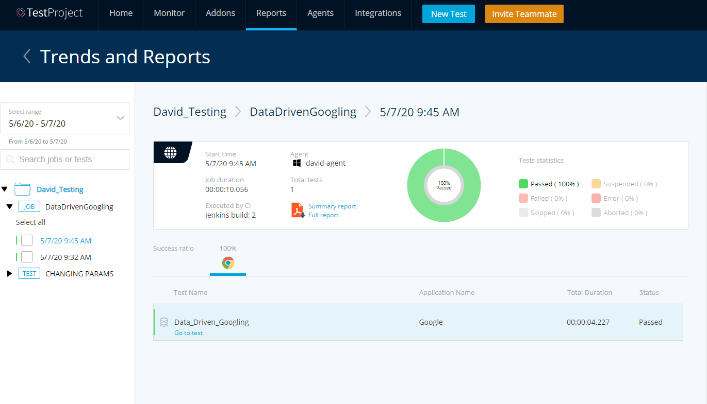

## Email and Web Hook Automation Reports

If you’d like to get [email notifications](https://docs.testproject.io/testproject-integrations/setting-up-email-notification) and web hook notifications of the status of your test automation execution, you can add these options to your job through the TestProject web platform.&#x20;

Head to the job you have created in your project and manage your job’s notification settings:

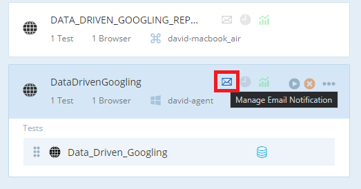

From there, you’ll be able to set who on your team should receive a notification or what web hook should receive a notification ([for example Slack](https://docs.testproject.io/testproject-integrations/integration-to-slack)), and when:

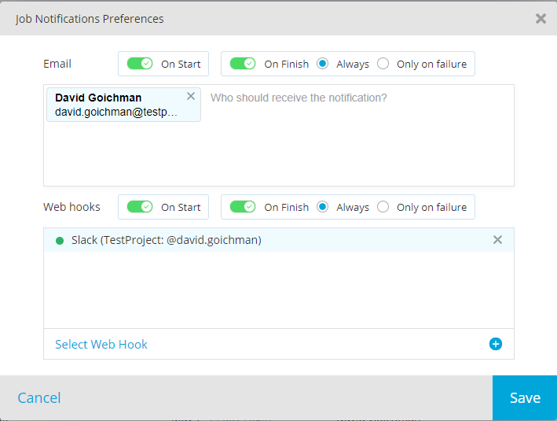

In the above Run TestProject Job examples, I will receive a notification **when the execution is triggered through the build** and **when it is finished** to both my email address and Slack web hook that is integrated with TestProject. Another option is to receive a notification only upon failure, which as discussed before, is linked to your TestProject job execution should you decide to wait for it to finish.

The following is an example of how the notification will look in Slack:

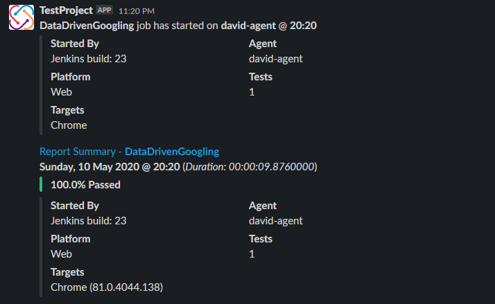

And the following is an example of how the notifications appears in an email form:

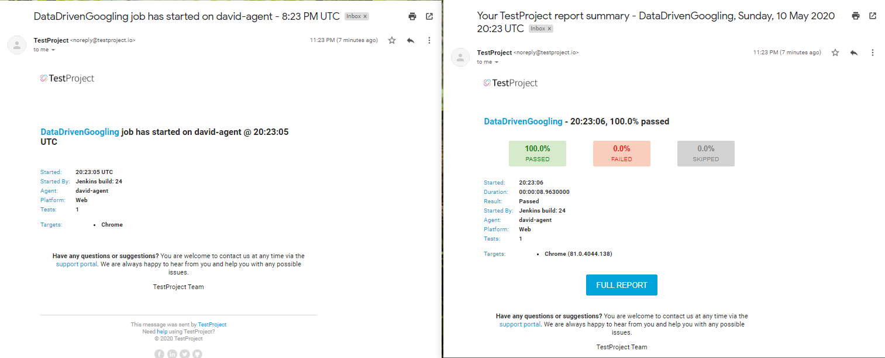

And of course, the final notification will contain some statistics and a direct link to the full execution report in your [TestProject reports section](https://app.testproject.io/#/reports).

## How to Fail Jenkins Build if Job Execution Fails

The success of the build is tied directly to the success of the TestProject job. This is determined by the **wait to finish** parameter you have set when creating your job/pipeline.&#x20;

If you choose to wait for the TestProject job to finish, the build will fail if the job fails and vice versa.&#x20;

If you want your build to be independent of the TestProject job, set the wait to finish parameter to 0, this will trigger the job and continue your build disregarding its result.

In the **Freestyle** job, set this to zero:

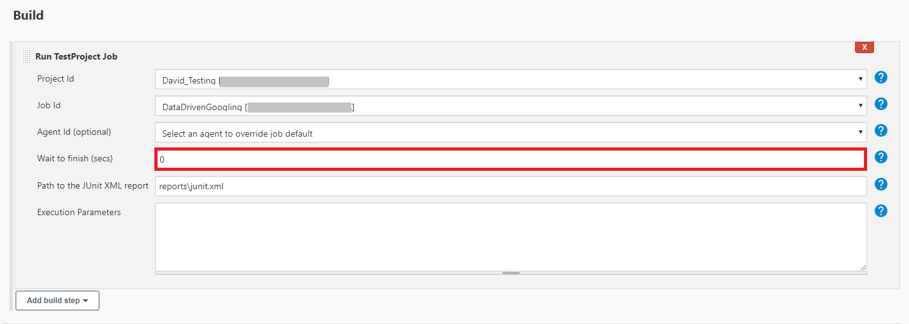

In the **pipeline**, set this to zero:


## Create Build Utilizing TestProject Agent in Docker Container

Using **tpAgentConfig: Generate TestProject Agent Configuration**, you can generate configuration for a TestProject Agent. This can be used to allow a [TestProject Agent running in a docker container](https://docs.testproject.io/testproject-agents/testproject-agent-in-docker) to automatically register, execute a job and terminate on completion.

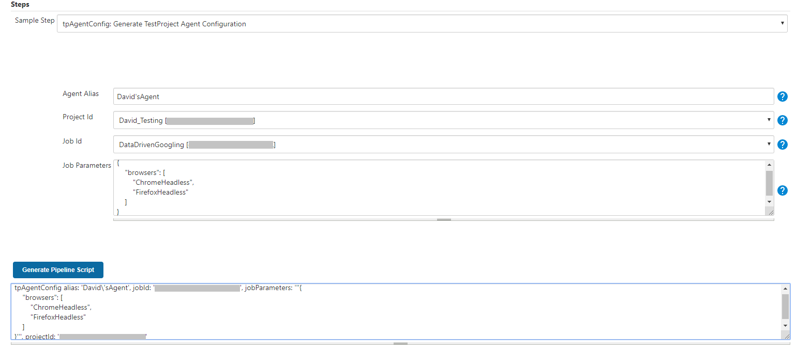

To read the agent configuration object in your pipeline script and access to the config property, follow the example below:

```
node {
    def agentConfig = tpAgentConfig(
            alias: '<AGENT_ALIAS>', 
            jobId: '<JOB_ID>', 
            jobParameters: '<JOB_PARAMETERS>', 
            projectId: '<PROJECT_ID>')

    print(agentConfig.config)
}
```

In case your docker agent was already registered previously:


And assigned to a job, you can use it in the same way explained in the previous Freestyle and pipeline examples. You can find more details regarding the docker agent at TestProject’s DockerHub page [here](https://hub.docker.com/r/testproject/agent) or in our Documentation [here](https://docs.testproject.io/testproject-agents/testproject-agent-in-docker).

## Get TestProject Automation Execution Reports in Jenkins Scope

The JUnit plugin accepts **XML test reports generated during the builds** and provides some **graphical visualization of the test as well as a web UI for viewing test reports**, tracking failures, and so on.&#x20;

If you want to get a report in JUnit format report from TestProject, **create a JUnit test result report post-build action**:

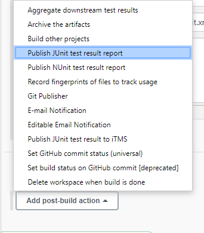

As mentioned previously, when creating a build step using the TestProject plugin, **you can specify a path for the JUnit XML report to be saved at**.&#x20;

We will reuse that path here:

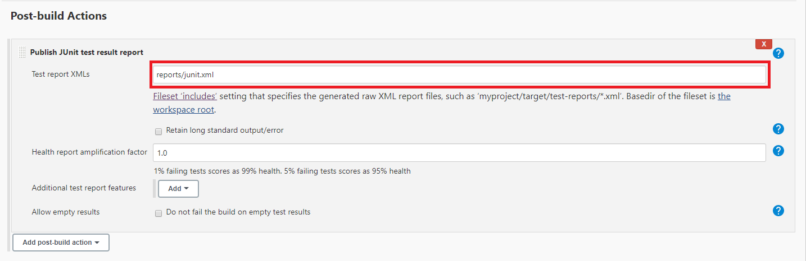


You could also use “reports/\*.xml” as a path, ignoring all old XML reports by default.

For creating a JUnit report using a pipeline, refer to the **second** example in the pipeline section above.

And **after running the build**, you should now be able to see trends and reports in your project:

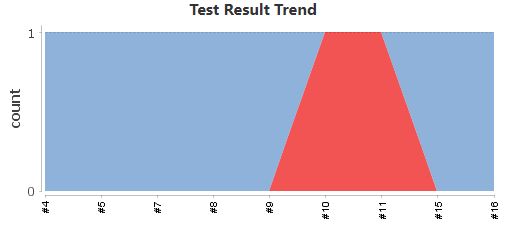

You can head to “**Test Result**” in your build to get more detailed information about your test execution:

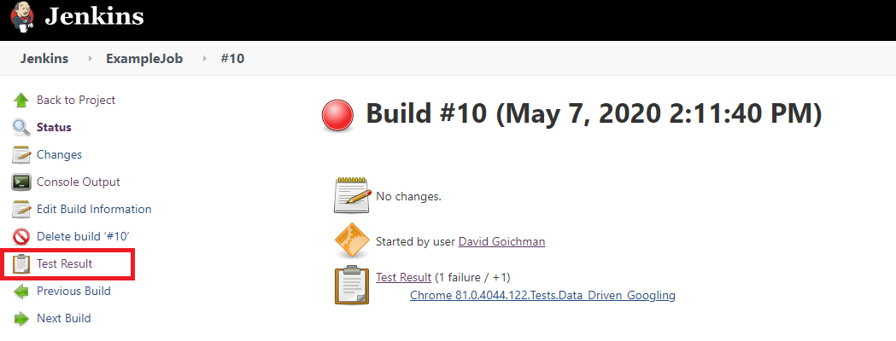


You can view more examples and the direct implementation of the plugin at our public GitHub repository located [here](https://github.com/testproject-io/jenkins-plugin).
