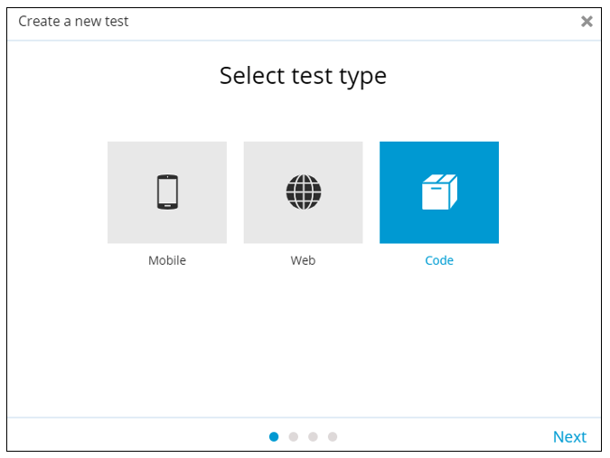

# C\#

## Getting Started

To get started, you need to complete the following prerequisites checklist:

* Login to your account at [https://app.testproject.io/](https://app.testproject.io) or [register](https://app.testproject.io/signup/) a new one.
* [Download](https://app.testproject.io/#/download) and install an Agent for your operating system or pull a container from [Docker Hub](https://hub.docker.com/r/testproject/agent).
* Run the Agent and [register](https://docs.testproject.io/getting-started/installation-and-setup#register-the-agent) it with your Account.
* Get a development token from [Integrations / SDK](https://app.testproject.io/#/integrations/sdk) page.

## Briefing

Following this tutorial you will know how to:

* Create your first C# SDK project & test.
* Create custom reports that suit your needs.
* Package & upload your test to TestProject platform.
* Run the test from the website.

## Creating Your First Project

Let's start by creating our first project.

In this tutorial we will use Visual Studio but you can use Visual Studio Code if you prefer. \
You can download both [here](https://visualstudio.microsoft.com).

First, open the _File_ menu and choose _New -> Project..._:

.png>)

Next, select the _SpecFlow Project_ option.

> &#x20;You can also build your tests with xUnit or MSTest, but we will use NUnit in this tutorial.

.png>)

Next name your project and press the _Create_ button. \
You will be greeted with the following project structure:\


.png>)

Next, let's add TestProject's OpenSDK to the project, so we can write our first test. All you need to do is:

1. Right click your project and select _Manage NuGet Packages..._.
2. Click the _Browse_ tab and search for `testproject opensdk`
3. You will see 2 dependencies: one for the SDK itself and one for TestProject's SpecFlow plugin, which we'll cover in another tutorial. Select TestProject.OpenSDK and click install.

 (1).png>)

Congratulations! You are now ready to write your first test.

## Writing Your First Test

Next, it's time to write our first test! You will notice your project already contains a class called _UnitTest1.cs_. This class contains a single empty test, ready to be executed.\
\


.png>)

Let's write our first test. This test will open the example page and perform a simple login. \
Here's the code below:

```csharp
using System.Threading;
using NUnit.Framework;
using OpenQA.Selenium;
using OpenQA.Selenium.Chrome;
using ChromeDriver = TestProject.OpenSDK.Drivers.Web.ChromeDriver;

namespace MyFirstOpenSDKTest.NUnit
{
    public class ExampleTest
    {
        private ChromeDriver driver;

        [SetUp]
        public void Setup()
        {
            driver = new ChromeDriver(chromeOptions: new ChromeOptions());
        }

        [Test]
        public void MyFirstTest()
        {
            driver.Navigate().GoToUrl("http://example.testproject.io");
            driver.FindElement(By.CssSelector("#name")).SendKeys("John Smith");
            driver.FindElement(By.CssSelector("#password")).SendKeys("12345");
            driver.FindElement(By.CssSelector("#login")).Click();
            Assert.IsTrue(driver.FindElement(By.CssSelector("#logout")).Displayed);
        }

        [TearDown]
        public void TearDown()
        {
            driver.Quit();
        }
    }
}
```

As you can see, the class now contains 3 methods:

* `Setup()` runs before the test and creates a new driver. No special configuration is needed at this point.
* `MyFirstTest()` is the actual test. It navigates to the TestProject example page, types user name and password, clicks the login button and checks the logout button is visible.
* `TearDown` runs after the test and quits the driver. It is good practice to quit your driver once you finish using it.

That's all the code we need to write our first test! \
Now let's make it run.

## Running the Test

To run tests using TestProject's OpenSDK you need to first install and register the TestProject Agent ([download link](https://app.testproject.io/#/download)). You also need a development token which can be obtained [here](https://app.testproject.io/#/integrations/sdk).

You can add the development token to your code, but a better way would be to specify it using an environment variable. To do this we need to add a _.runsettings_ to the project.

The contents of the _.runsettings_ file should be as follows:

```
<RunSettings>
  <RunConfiguration>
    <EnvironmentVariables>
      <!-- List of environment variables we want to set-->
      <TP_DEV_TOKEN>YOUR_DEV_TOKEN</TP_DEV_TOKEN>
    </EnvironmentVariables>
  </RunConfiguration>
</RunSettings>
```

And that's it! Time to run our test. Here's how it's done:

* Make sure your agent is running and registered.
* Open the test explorer by opening the _Test_ menu and selecting the _Test Explorer_ option.
* Press the _Options_ button (rightmost button) and make sure _Configure Run Settings -> Auto Detect runsettings File_ is enabled.
* Press the _Play_ button and watch your test run!

Well done, you just ran your first test! \
Let's check the result and see what happened in the [report](https://app.testproject.io/#/reports).

## Customize Your Report

Now that we ran our first test, let's check the report.

When you run tests that use TestProject's driver, reports are created on the platform automatically. \
Here's the report that was created by our test:\


.png>)

As you can see, OpenSDK inferred project, job and test names all by itself and reported all driver actions as steps. Here's how it does it:

* Project name is inferred from the test class' namespace - in this case it's `MyFirstOpenSDKTest.NUnit`
* Job name is inferred from the test class name - in this case it's `ExampleTest`
* Test name is inferred from the test method's name - in this case it's `MyFirstTest`

It's a great start. However, These are "programmer names" and do not look nice in the report. \
Let's improve them!

### Project, Job & Test Names

First, let's specify project & job names ourselves. This is done in the driver's constructor. \
Simply change the `SetUp` method to the following:

```csharp
[SetUp]
public void Setup()
{
    driver = new ChromeDriver(chromeOptions: new ChromeOptions(), projectName: "My First C# Project", jobName: "My First C# Job");
}
```

Now we can run our test and get a new report:

.png>)

Notice how the project and job names changed, but the test name still looks weird. Let's fix that as well.

Luckily for us, TestProject's OpenSDK knows to infer test name from the NUnit attribute. \
All we need to do is change our `[Test]` attribute as follows:

```csharp
[Test(Description = "My First Test")]
```

Now we can run our test again and check the new report:

.png>)

### Custom step reports

The last thing we want to do is report a few extra steps, to make our report look more robust. Luckily for us, TestProject's drivers contain an easy-to-use reporting mechanism for manually reporting steps.

Let's add a few extra step reports to our current test:

```csharp
[Test(Description = "My First Test")]
public void MyFirstTest()
{
    driver.Navigate().GoToUrl("http://example.testproject.io");
    driver.FindElement(By.CssSelector("#name")).SendKeys("John Smith");
    driver.FindElement(By.CssSelector("#password")).SendKeys("12345");
    driver.Report().Step("Login Information provided", screenshot: true);
    driver.FindElement(By.CssSelector("#login")).Click();
    driver.Report().Step("Logged in successfully", passed: driver.FindElement(By.CssSelector("#logout")).Displayed);
}
```

As you can see we added 2 new steps using the `driver.Report().Step()` method:

* The first step indicates we were able to provide the login information. It will also take a screenshot at this point.
* The second step indicates we were able to login successfully, and will pass only if we actually logged in.

Here's a look at the full report, where you can see the new steps, #7 and #11:

.png>)

Now that we have a working test, let's upload it to TestProject and run it from there.


## Cloud and Local Report

By default, the execution report is uploaded to the cloud, and a local report is created, as an HTML file in a temporary folder.

At the end of execution, the report is uploaded to the cloud and SDK outputs to the console/terminal the path for a local report file:

`Execution Report: {temporary_folder}/report.html`

This behavior can be controlled, by requesting only a `LOCAL` or only a `CLOUD` report.

> When the Agent is offline, and only a _cloud_ report is requested, execution will fail with appropriate message.

Via a driver constructor:

```
var driver = new ChromeDriver(chromeOptions: new ChromeOptions(), reportType: ReportType.LOCAL);
```

Via Driver Builder:

```
var driver = new DriverBuilder<FirefoxDriver>()
    .WithJobName("DriverBuilder Job")
    .WithProjectName("TestProject C# OpenSDK")
    .WithReportType(ReportType.LOCAL)
    .Build();
```

## Package & Upload Tests to TestProject

The next step is to upload our test to the TestProject platform, so we can trigger it remotely from there.

### Package

Before uploading our Test, we should package them into a single ZIP file. Here's how to do it:

* Right-click your solution in the _Solution Explorer_ panel and select _Publish..._

#### First time publishing

If this is your first time publishing, create a new publishing target:

* Choose _Folder_ as your publish target, and press _Next_.&#x20;

 (1).png>)

* Choose _Folder_ again, and press _Next_.

 (1) (1) (1) (1).png>)

* Change the folder your code is built in to _publish\\_ and press _Finish_.

#### Publish&#x20;

* Press _Publish_ next to the _FolderProfile_ target to create this folder.

 (1).png>)

* Right-click your solution in the _Solution Explorer_ panel and select _Open Folder in File Explorer_.
* Zip the newly created `out` folder (right-click the _publish_ folder and select _Send To -> Compressed (Zipped) archive)_

### Upload

Now we can upload it to TestProject platform.

In order to upload your test to TestProject, navigate to [http://app.testproject.io](http://app.testproject.io), then click on **New Test** and choose the **Code** option:



Click **next**, upload your ZIP file and create a test package:

 (1).png>)

Here you can see a list of all the tests (or test in this case) in your zip file:

.png>)

Next, name your test package:

.png>)

Now we can execute our test, just click on the play button:

.png>)

## Sources

The whole solution and project including demonstrated sources are [available in GitHub](https://github.com/testproject-io/opensdk-examples/csharp).

## Summary

This tutorial taught us five things:

* How to create a C# Project that runs TestProject's OpenSDK tests.
* How to use TestProject's C# OpenSDK to write tests.
* How to customize the automatic reports to use our own test, job and project names.
* How to report custom steps of our own.
* How to package & upload our tests to TestProject's platform.
