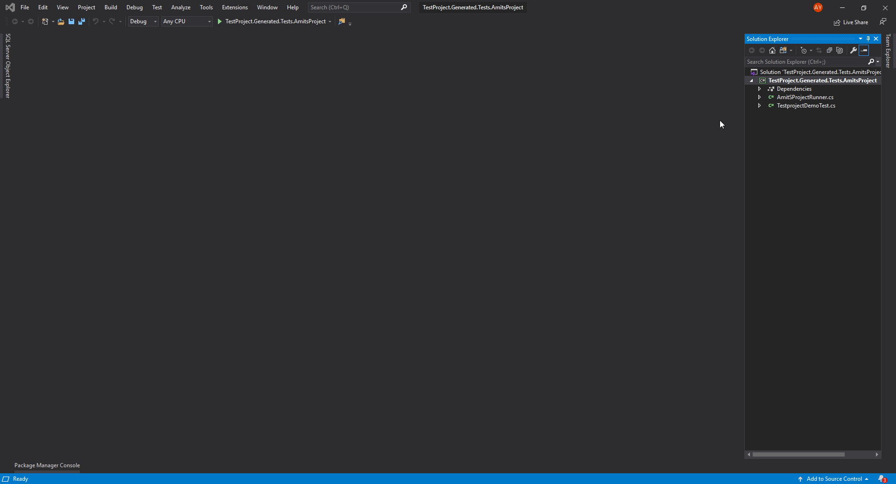

# C\#

This repository contains code examples based on TestProject C\# SDK.

## Briefing

This document describes the bare minimum steps to start developing tests using the C\# .Net Core SDK.  
 TestProject provides a unified test automation SDK with support for Android, iOS and Web applications by utilizing the open-source Selenium and Appium frameworks. TestProject is OS agnostic and can run on Windows, Linux or Mac. It is a full stack automation framework with capabilities that allow automation test management, remote and local test execution, job scheduling, reporting dashboards, collaboration and more. TestProject's C\# SDK adds several features not present in .Net Core such as Page Object support via PageFactory.

## Minimum Requirements

* In order to develop TestProject C\# tests/addons, you must have .Net Core SDK version v2.1 \(Can be downloaded [here](https://dotnet.microsoft.com/download/dotnet-core/2.1)\)
* In order to execute C\# tests/addons, you must have .Net Runtime v2.1 \(Can be downloaded [here](https://dotnet.microsoft.com/download/dotnet-core/2.1)\). Please note that newer framework version are not compatible with 2.1.
* If you are developing with visual studio, you must use Visual Studio 2017 \(Can be downloaded [here](https://visualstudio.microsoft.com/downloads/)\)

## Preparations

To kick-off automation development with TestProject, it is necessary to have an active TestProject account and the TestProject Agent installed.  
 TestProject's Agent is a cross-platform desktop application, allowing you to create, debug and execute your test automation locally. TestProject Agent can be downloaded from [Agents](https://app.testproject.io/#/agents) page.

### Getting C\# SDK

You can download TestProject SDK for C\# from the [Developers](https://app.testproject.io/#/developers) page and reference it in your project.

## Test Development

The best way to start developing automated tests with TestProject is by reviewing the source code of a basic test that performs a login and updates a profile form, expecting the save to succeed.\

* [Web](https://github.com/testproject-io/csharp-sdk-examples/blob/c2521f270b79b0e89bf4b309016cb06b732cc0dd/Web/Test/TestProject.SDK.Examples.Web.Test/Test/BasicTest.cs) test executed on [TestProject Demo](https://example.testproject.io/web/index.html) website.
* [Android](https://github.com/testproject-io/csharp-sdk-examples/blob/c2521f270b79b0e89bf4b309016cb06b732cc0dd/Android/Test/TestProject.SDK.Examples.Android.Test/Test/BasicTest.cs) test executed on [TestProject Demo](https://github.com/testproject-io/android-demo-app) App for Android.
* [iOS](https://github.com/testproject-io/csharp-sdk-examples/blob/c2521f270b79b0e89bf4b309016cb06b732cc0dd/IOS/Test/Test/BasicTest.cs) test executed on [TestProject Demo](https://github.com/testproject-io/ios-demo-app) App for iOS.

There is also a [Generic](https://github.com/testproject-io/csharp-sdk-examples/blob/c2521f270b79b0e89bf4b309016cb06b732cc0dd/Generic/Test/TestProject.SDK.Examples.Generic.Test/Test/BasicTest.cs) test, representing a dummy scenario that can be automated.  
 It can be used as a reference for real scenarios that automate a non-UI sequences \(those that do not require a Selenium or Appium driver\).

### Build your first C\# Project

To begin, let's create a .Net Core project and add TestProject SDK as a reference:

* Open Visual studio and create a new project
* From the left side select `Visual C# => .Net Core`. Then, select `Class Library`
* Once the project has been created, right-click the project and select `Manage Nuget Packages...`.
* Search for `TestProject SDK` and install it in your project.
* Right click your project file and press `Edit Project File`
* Find the tag containing TestProject SDK and add to it the `Publish="false"` property. This is required to package your final code for uploading to TestProject website.

There we go, now we're all set! Let's see what

### Test Class

In order to build a Test that can be executed by TestProject, the class has to implement on of the interfaces that the SDK provides.  
 Interface implementation requires an implementation of the _Execute\(\)_ method, that will be be invoked by the platform to run the Test.  
 The _Execute\(\)_ method returns _ExecutionResult_ enum which can be **PASSED** or **FAILED**.

Below are some examples for Test implementation on different platforms:

**Web Test**

BasicTest class implements the _IWebTest_ interface:

```text
public class BasicTest : IWebTest
```

Test entry point is the _Execute_ method:

```text
public ExecutionResult Execute(WebTestHelper helper)
```

The following line of code retrieves a driver to automate the browser.

```text
// Get driver initialized by TestProject Agent
// No need to specify browser type, it can be done later via UI
var driver = helper.Driver;
```

Following code is used to navigate the browser to the relevant URL. After it is executed, TestProject Demo page is loaded.

```text
// Navigate to TestProject Demo website
driver.Navigate().GoToUrl("https://example.testproject.io/web/");
```

The following code uses the Page Object Model pattern to login in and complete a profile form, saving it:

```text
// Initialize the properties of the LoginPage with the driver
var loginPage = new LoginPage();
PageFactory.InitElements(driver, loginPage);

// Login using provided credentials
loginPage.Login(name, password);

// Initialize the properties of the profilePage with the driver
var profilePage = new ProfilePage();
PageFactory.InitElements(driver, profilePage);
            
// Complete profile forms and save it
profilePage.UpdateProfile(country, address, email, phone);
```

The following return statement will assert test result:

```text
return profilePage.Saved ? ExecutionResult.Passed : ExecutionResult.Failed;
```

**Android Test**

BasicTest class implements the _IAndroidTest_ interface:

```text
public class BasicTest : IAndroidTest
```

Test entry point is the _Execute_ method:

```text
public ExecutionResult Execute(AndroidTestHelper helper)
```

The following line of code retrieves a driver to automate the App.

```text
// Get driver initialized by TestProject Agent
var driver = helper.Driver;
```

The following code resets the App and uses the Page Object Model pattern to login in and complete a profile form, saving it:

```text
driver.ResetApp();

// Login using provided credentials
var loginPage = new LoginPage(driver);
PageFactory.InitElements(driver, loginPage);

// Perform login
loginPage.Login(name, password);

// Complete profile form
var profilePage = new ProfilePage(driver);
PageFactory.InitElements(driver, profilePage);

profilePage.UpdateProfile(country, address, email, phone);
```

The following return statement will assert test result:

```text
return profilePage.Saved ? ExecutionResult.Passed : ExecutionResult.Failed;
```

**iOS Test**

BasicTest class implements the _IIOSTest_ interface:

```text
public class BasicTest : IIOSTest
```

Test entry point is the _Execute_ method:

```text
public ExecutionResult Execute(IOSTestHelper helper)
```

The following line of code retrieves a driver to automate the App.

```text
// Get driver initialized by TestProject Agent
var driver = helper.Driver;
```

The following code resets the App and uses the Page Object Model pattern to login in and complete a profile form, saving it:

```text
driver.ResetApp();

// Login using provided credentials
var loginPage = new LoginPage(driver);
PageFactory.InitElements(driver, loginPage);

// Perform login
loginPage.Login(name, password);

// Complete profile form
var profilePage = new ProfilePage(driver);
PageFactory.InitElements(driver, profilePage);

profilePage.UpdateProfile(country, address, email, phone);
```

The following return statement will assert test result:

```text
return profilePage.Saved ? ExecutionResult.Passed : ExecutionResult.Failed;
```

**Generic Test**

BasicTest class implements the _IGenericTest_ interface:

```text
public class BasicTest : IGenericTest
```

Test entry point is the _execute_ method:

```text
public ExecutionResult Execute(GenericTestHelper helper)
```

The following code adds the value stored in 'a' variable to the value in 'b' and if equals 2, asserts success:

```text
int a = 1, b = 1;

if (a + b == 2)
    return ExecutionResult.Passed;
else
    return ExecutionResult.Failed;
```

### Debugging / Running Test

To debug or run the test locally, you will have to use the _Runner_ class from TestProject SDK. All code examples, have NUnit tests that use _Runner_ to debug the automation locally. Debugging or running a test locally with the _Runner_ class, requires authentication before communication with the TestProject Agent \(since it is the execution engine\). Development token for authentication can be easily obtained from the [Developers](https://app.testproject.io/#/developers) page. It should be used as a parameter in one of the _Runner_ factory methods:

**Web**

```text
var runner = RunnerFactory.Instance.CreateWeb("YOUR_DEV_TOKEN", AutomatedBrowserType.Chrome) // Use the BrowserName you need
```

**Android**

```text
var runner = RunnerFactory.Instance.CreateAndroid("YOUR_DEV_TOKEN", "YOUR_EMULATOR_ID", "YOUR_APP_PACKAGE", "YOUR_ACTIVITY")
```

**Chrome on Android**

```text
var runner = RunnerFactory.Instance.CreateAndroidWeb("YOUR_DEV_TOKEN", "YOUR_EMULATOR_ID", BrowserName.Chrome) // Use the BrowserName you need
```

**iOS**

```text
var runner = RunnerFactory.Instance.CreateIOS("YOUR_DEV_TOKEN", "YOUR_IOS_DEVICE_ID", "YOUR_IOS_DEVICE_NAME", "YOUR_IOS_APP")
```

**Safari on iOS**

```text
var runner = RunnerFactory.Instance.CreateIOSWeb("YOUR_DEV_TOKEN", "YOUR_IOS_DEVICE_ID", "YOUR_IOS_DEVICE_NAME")
```

**Generic**

```text
var runner = RunnerFactory.Instance.Create("YOUR_DEV_TOKEN")
```

### Using parameters and step reports in your tests

Let's make our example more advanced by adding parameters. To add parameters to your test, you simply need to add fields with relevant attributes.  
 In addition, we will create step reports to separate the different stages of the test \(each report will appear as a separate step in the future execution reports\).

See the relevant platform link for full source code:

* [Web - Extended Test](https://github.com/testproject-io/csharp-sdk-examples/blob/c2521f270b79b0e89bf4b309016cb06b732cc0dd/Web/Test/TestProject.SDK.Examples.Web.Test/Test/ExtendedTest.cs)
* [Android - Extended Test](https://github.com/testproject-io/csharp-sdk-examples/blob/c2521f270b79b0e89bf4b309016cb06b732cc0dd/Android/Test/TestProject.SDK.Examples.Android.Test/Test/ExtendedTest.cs)
* [iOS - Extended Test](https://github.com/testproject-io/csharp-sdk-examples/blob/c2521f270b79b0e89bf4b309016cb06b732cc0dd/IOS/Test/Test/ExtendedTest.cs)
* [Generic - Extended Test](https://github.com/testproject-io/csharp-sdk-examples/blob/c2521f270b79b0e89bf4b309016cb06b732cc0dd/Generic/Test/TestProject.SDK.Examples.Generic.Test/Test/ExtendedTest.cs)

#### Test Attributes

TestProject SDK provides attributes to describe the test and its parameters:

1. The _**Test**_ attribute is used to better describe the Test and define how it will appear later in TestProject UI:
   * **Name** - The name of the test \(if omitted, the name of the class will be used\).
   * **Description** - A short description of the test which is shown in various places in TestProject platform \(e.g. reporting dashboard\). The description may contain placeholders {{propertyName}} that will be changed dynamically according to test parameters.
   * **Version** - A version string which is used for future reference.
2. The _**Parameter**_ attribute is used to better describe your Test inputs and outputs, in the example above there are two inputs - _url_ and _expectedTitle_.
   * **Description** - The description of the parameter
   * **Direction** - Defines the parameter as an _Input_ \(default if omitted\) or an _Output_ parameter. An _Input_ parameter will receive values when the test is executed while the _Output_ parameter value will be retrieved at the end of test execution \(and can be used in following steps later on in the automation scenario\).
   * **DefaultValue** - Defines a default value that will be used for the parameter.

#### Reports

Implemented _Execute\(\)_ method receives a _Helper_ instance as a parameter.  
 Via this helper, you can obtain an instance of _TestReporter_ class.

```text
var report = helper.Reporter;
```

Notice the following line in the Extended Test example.  
 This line reports a step based on provided condition and takes a screenshot:

```text
report.Step("Profile information saved", profilePage.Saved, TakeScreenshotConditionType.Always);
```

Using the following code one can set test result message:

```text
report.Result = "Test completed successfully";
```

## Addon development

Much like Tests you can develop custom Addons to extend TestProject and shape your automated testing solution for your needs.  
 An Addon is a set of Actions \(one or more\) where each Action does a specific task, a common Addon scenario will be to extend basic set of Actions on complicated UI elements or make wrappers for user defined API.  
 Once created, Actions can be used to design steps of automated tests.

### Addon Manifest

To start developing an Addon a manifest file is required. The manifest is a descriptor of your Addon, it contains a unique GUID for the addon and a list of required permissions.  
 Create an Addon in the [Addons](https://app.testproject.io/#/addons/account) screen and download the generated manifest. Then, add the manifest to your package as follows:

* If your addon consists of a single file \(e.g. has no dependencies\), add the manifest to your project root folder. Then, mark it as an embedded resource by opening the _Properties_ panel and change _Build Action_ to _Embedded Resource_.
* If your addon consists of multiple files \(e.g. has dependencies\), add the manifest to the .zip file that you are going to upload to TestProject.

### Implement the Addon

Lets review a simple Addon with a **ClearFields** action that clears a form. It can be used on the login form in TestProject Demo website or mobile App:

* [Web - Action](https://github.com/testproject-io/csharp-sdk-examples/blob/c2521f270b79b0e89bf4b309016cb06b732cc0dd/Web/Addon/TestProject.SDK.Examples.Web.Addon/Addon/ClearFieldsAction.cs)
* [Android - Action](https://github.com/testproject-io/csharp-sdk-examples/blob/c2521f270b79b0e89bf4b309016cb06b732cc0dd/Android/Addon/TestProject.SDK.Examples.Android.Addon/Addon/ClearFieldsAction.cs)
* [iOS - Action](https://github.com/testproject-io/csharp-sdk-examples/blob/c2521f270b79b0e89bf4b309016cb06b732cc0dd/IOS/Addon/TestProject.SDK.Examples.IOS.Addon/Addon/ClearFieldsAction.cs)

There is also a [Generic](https://github.com/testproject-io/csharp-sdk-examples/blob/c2521f270b79b0e89bf4b309016cb06b732cc0dd/Generic/Addon/TestProject.SDK.Examples.Generic.Addon/Addon/AdditionAction.cs) action, representing a dummy scenario that can be automated.  
 It can be used as a reference for real scenarios that automate a non-UI \(those hat do not require a Selenium or Appium driver\) actions.

#### Action Class

In order to build an Action that can be executed by TestProject, the class has to implement one of the interfaces that the SDK provides.  
 Action class can also be decorated with the _\[Action\]_ attribute to provide extra information about the action.

Interface implementation requires an implementation of the _Execute\(\)_ method, that will be be invoked by the platform to run the Action.  
 The _Execute\(\)_ method returns _ExecutionResult_ enum which can be **PASSED** or **FAILED**.

**Web Action**

```text
[Action(Name = "Clear Fields")]
public class ClearFieldsAction : IWebAction
```

Action entry point is the _Execute_ method:

```text
public ExecutionResult Execute(WebAddonHelper helper)
```

Action code searches for visible Forms and then for contained inputs elements, clearing them one by one:

```text
// Get Driver
var driver = helper.Driver;

// Search for Form elements
foreach (IWebElement form in driver.FindElements(By.TagName("form")))
{
    // Ignore invisible forms
    if (!form.Displayed)
        continue;

    // Clear all inputs
    foreach (IWebElement element in form.FindElements(By.TagName("input")))
        element.Clear();
}

return ExecutionResult.Passed;
```

**Android Action**

```text
[Action(Name = "Clear Fields")]
public class ClearFieldsAction : IAndroidAction
```

Action entry point is the _Execute_ method:

```text
public ExecutionResult Execute(AndroidAddonHelper helper)
```

Action code searches for EditText elements, clearing them one by one:

```text
foreach (AndroidElement element in helper.Driver.FindElements(By.ClassName("android.widget.EditText")))
    element.Clear();
```

**iOS Action**

```text
@Action(name = "Clear Fields")
public class ClearFields : IIOSAction
```

Action entry point is the _Execute_ method:

```text
public ExecutionResult Execute(IOSAddonHelper helper)
```

Action code searches for XCUIElementTypeTextField and XCUIElementTypeSecureTextField elements, clearing them one by one:

```text
for (var element in helper.Driver.findElements(By.className("XCUIElementTypeTextField")))
    element.clear();

for (IOSElement element : helper.Driver.findElements(By.className("XCUIElementTypeSecureTextField")))
    element.clear();
```

**Generic Action**

```text
[Action(Name = "Addition", Description = "Add {{a}} to {{b}}")]
public class AdditionAction : IGenericAction
```

Action entry point is the _Execute_ method:

```text
public ExecutionResult Execute(GenericAddonHelper helper)
```

Action code performs an addition of values in two variables, assigning result to third:

Actions run in context of a test and assume that required UI state is already in place.  
When the action will be used in a test it will be represented as a single step, usually preceded by other steps.  
However, when debugging it locally, preparations should be done using the _Runner_ class to start from expected UI state:

**Web - State Preparation**

```text
// Create Action
ClearFields action = new ClearFields();

// Prepare state
var driver = (WebDriver)runner.GetDriver();
driver.Navigate().GoToUrl("https://example.testproject.io/web/");
driver.FindElement(By.Id("name")).SendKeys("John Smith");
driver.FindElement(By.Id("password")).SendKeys("12345");

// Run action
runner.Run(action);
```

**Android - State Preparation**

```text
// Create Action
var action = new ClearFields();

// Prepare state
var driver = (AndroidDriver)runner.GetDriver();
driver.FindElement(By.Id("name")).SendKeys("John Smith");
driver.FindElement(By.Id("password")).SendKeys("12345");

// Run action
runner.Run(action);
```

**iOS - State Preparation**

```text
// Create Action
var action = new ClearFields();

// Prepare state
var driver = (IOSDriver)runner.GetDriver();
driver.FindElement(By.Id("name")).SendKeys("John Smith");
driver.FindElement(By.Id("password")).SendKeys("12345");

// Run action
runner.Run(action);
```

#### Action Attributes

TestProject SDK provides attributes to describe the action:

1. The _**Action**_ attribute is used to better describe your action and define how it will appear later in TestProject UI:
   * **Name** - The name of the action \(if omitted, the name of the class will be used\).
   * **Description** - A description of the test which is shown in various places in TestProject platform \(reports for example\). The description can use placeholders {{propertyName}} do dynamically change the text according to test properties.
   * **Version** - A version string which is used for future reference.
2. The _**Parameter**_ attribute is used to better describe your action's inputs and outputs, in the example above there are two parameters - _question_ and _answer_.
   * **Description** - The description of the parameter
   * **Direction** - Defines the parameter as an _input_ \(default if omitted\) or an _output_ parameter. An _input_ parameter will able to receive values when it is being executed while the _output_ parameter value will be retrieved at the end of test execution \(and can be used in other places later on in the automation scenario\).
   * **DefaultValue** - Defines a default value that will be used for the parameter.

> NOTE: Unlike tests, actions cannot use assertions because an action is a single generic reusable unit.

### Debugging / Running Actions

To debug or run the action locally, you will have to use the _Runner_ class from TestProject SDK. All code examples, have NUnit tests that use _Runner_ to debug the automation locally.

### Element Actions

Actions can be element based, when their scope is limited to operations on a specific element and not the whole DOM.  
 This allows creating smart crowd based addons for industry common elements and libraries.

_TypeRandomPhone_ is an example of an Element Action:

* [Web - Element Action](https://github.com/testproject-io/csharp-sdk-examples/blob/c2521f270b79b0e89bf4b309016cb06b732cc0dd/Web/Addon/TestProject.SDK.Examples.Web.Addon/Addon/TypeRandomPhoneAction.cs)
* [Android - Element Action](https://github.com/testproject-io/csharp-sdk-examples/blob/c2521f270b79b0e89bf4b309016cb06b732cc0dd/Android/Addon/TestProject.SDK.Examples.Android.Addon/Addon/TypeRandomPhoneAction.cs)
* [iOS - Element Action](https://github.com/testproject-io/csharp-sdk-examples/blob/c2521f270b79b0e89bf4b309016cb06b732cc0dd/IOS/Addon/TestProject.SDK.Examples.IOS.Addon/Addon/TypeRandomPhoneAction.cs)

This action generates a random phone number based on provided country code and max digits amount, typing it in a text field:

```text
var randomer = new Random();
long number = randomer.Next(1, (int)Math.Pow(10, maxDigits));
phone = $"+{countryCode}{number}";
element.SendKeys(phone);
return ExecutionResult.Passed;
```

It also stores the result in an output field \(see the attribute and _**ParameterDirection.OUTPUT**_ configuration\) for further use later in test.  
 When the action is debugged using a Runner via NUnit test, it's important to pass the element search criteria into the action:

```text
runner.Run(action, By.Id("phone"));
```

After the Addon is uploaded to TestProject platform this will be done via UI.

#### Element Type

Element Actions are made to be used on a specific Element Types. Element Types are defined in TestProject using XPath to describe target elements similarities:Web - Element Type

It can be a simple definition such as:

```text
//div
```

Or a more complex one, such as:

```text
//div[contains(@class, 'progressbar') and contains(@class, 'widget') and @role = 'progressbar']
```

**Android - Element Type**

It can be a simple definition such as:

```text
//android.widget.Button
```

Or a more complex one, such as:

```text
//android.support.v7.widget.RecyclerView[contains(@resource-id, 'my_view') and .//android.widget.TextView[not(contains(@resource-id, 'average_value'))]]
```

**iOS - Element Type**

It can be a simple definition such as:

```text
//XCUIElementTypeButton
```

Or a more complex one, such as:

```text
//XCUIElementTypeSearchField[contains(@label = 'Categories')]
```

It is up to the Action developer how to narrow and limit the list of element types that the action developed will be applicable to.

## Crowd Code / Addon Proxy

One of the greatest features of the TestProject environment is the ability to execute a code written by someone else.  
It can be your account colleagues writing actions that you can reuse, or TestProject community users.  
Developer must download a binary file with the proxy class for the Action he wants to execute.

Assuming your account member uploaded the example Addon, named it _**Example Addon**_ and you want to reuse it's code your Test.  
To do so, you can download it's proxy DLL and use it like this:

```text
var clearFieldsAction = ExampleAddon.CreateClearFieldsAction();
```

Implemented _Execute\(\)_ method receives a _Helper_ instance as a parameter.  
Via this helper, you can execute the proxy by invoking the _**ExecuteProxy**_ method:

```text
StepExecutionResult result = helper.ExecuteProxy(clearFieldsAction);
```

See examples:

* [Web - Proxy Test](https://github.com/testproject-io/csharp-sdk-examples/blob/master/Web/Test/TestProject.SDK.Examples.Web.Test/Test/ProxyTest.cs)
* [Android - Proxy Test](https://github.com/testproject-io/csharp-sdk-examples/blob/master/Android/Test/TestProject.SDK.Examples.Android.Test/Test/ProxyTest.cs)
* [iOS - Proxy Test](https://github.com/testproject-io/csharp-sdk-examples/blob/master/IOS/Test/Test/ProxyTest.cs)

## Packaging

In order to upload your Addons or Tests to TestProject you must prepare either a _DLL_ file or a _ZIP_ file:

* If your package only depends on TestProject SDK, you can upload the built _DLL_ file to TestProject UI.
* If your package has other dependencies \(e.g. DropBox API\), Create a zip file from your project output \(including dependencies, excluding TestProject SDK\) and upload it to TestProject UI.

You can build the solution through your IDE, such as Visual Studio:



You can also build it through your Terminal/PowerShell/Command prompt.

Here's a simple example based on our [Web - Proxy Test](https://github.com/testproject-io/csharp-sdk-examples/blob/master/Web/Test/TestProject.SDK.Examples.Web.Test/Test/ProxyTest.cs) Example  
 To upload this test we will have to create a _ZIP_  file containing 2 _DLL_ files:

* TestProject.SDK.Examples.Web.Tests.dll - This is the project output.
* AddonProxy.dll - the addon proxy this test uses.

If your project contains external dependencies, follow these step to package it:

* Open a Terminal/PowerShell/Command prompt and navigate to the folder of your main project
* Run the following command: `dotnet publish -o ./publish ./your-project.csproj`. make sure to use your project's csproj file.
* Open the publish folder we just created and zip all the files

To upload the package, head to your project on the TestProject platform, and create a **new test**.


Select the **code** option.


**Upload** your DLL or zip.


 Press **next**.


Give your package a **name**, **description** and choose an **application** and press next to complete the process.


> When using windows you can select all files and right click -&gt; Send to -&gt; Compressed archive.  
>  If using a different application to compress, always use Normal compression

## Support

For any further inquiries, please use TestProject support channels:

* [Forum](https://forum.testproject.io/)
* In-app Chat
* Email at support@testproject.io

