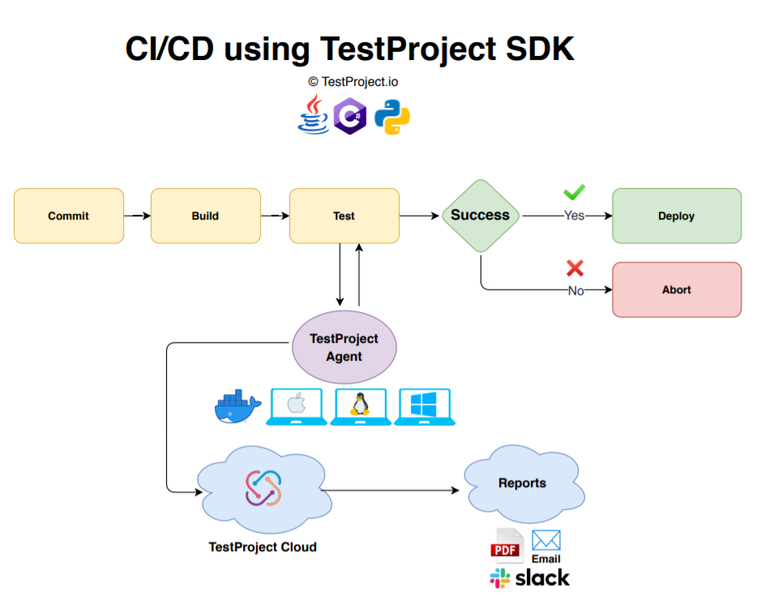
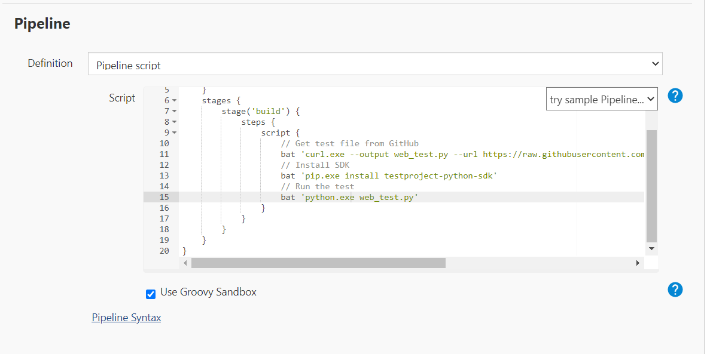
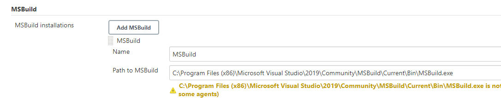
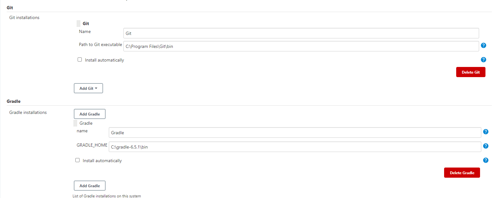
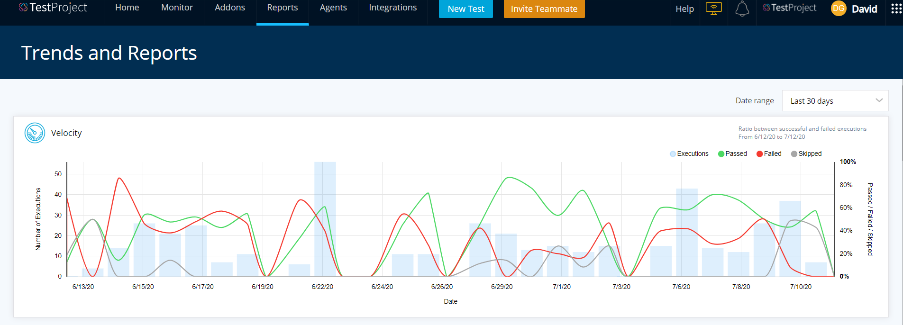
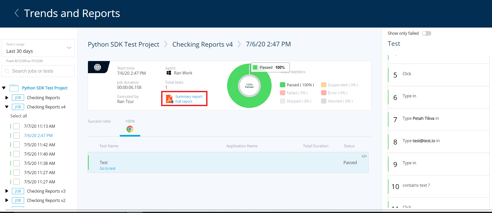

# Using TestProject Scripted Tests within CI/CD

## Introduction

Software testing is most likely the most important part of any software development lifecycle. Functional testing plays a very significant role in the development lifecycle, it is the process of testing how closely an application matches its required specifications and works as intended. Essentially, functional testing is the way to see how an application will behave while executed by its users. It revolves around testing different scenarios and actions users can be a part of and how the application can handle them.

Functional testing ensures us that:

1. Requirements are met.
2. Product is defect free.
3. The user base is satisfied.
4. The functionalities of an application are working as intended.

Functional testing is usually carried out at the end of the development cycle before deployment.

Here we will review how to use TestProject scripted tests within a CI/CD pipeline, including examples for Python, C\# and Java tests. 



## TestProject Agent

The [TestProject Agent](https://docs.testproject.io/testproject-agents/) is a powerful component installed on a local machine, virtual machine or inside a [docker container](https://docs.testproject.io/testproject-agents/testproject-agent-in-docker). Agents allow you to run tests in any browser or mobile device and generate powerful reports. It comes pre-packed with all the Selenium and Appium dependencies that you’ll need to get started testing and to create dynamic reports based on the test’s execution flows.


Please make sure your agent is installed and running before continuing.


TestProject Agents can be installed on all major operating systems including Windows, Linux and macOS. As mentioned previously, the Agent can also be installed as a Docker container.

To install the TestProject Agent on your local or virtual machine, you can head over to the TestProject platform at [https://app.testproject.io/\#/agents](https://app.testproject.io/#/agents)

Download an Agent and install it using the installation wizard.

While setting up the TestProject agent on a docker container, you’ll be able to use it in two distinct ways, as described on our [DockerHub](https://hub.docker.com/r/testproject/agent) page:

1. **Permanent Execution Engine** - The Agent is registered once, and then can be used to execute tests and jobs from the TestProject web application.
2. **Ephemeral Instances** - In this scenario the Agent is started up in order to perform a specific task, and will self terminate upon completion of said task.

The operation mode of the Agent is controlled by environment variables that are passed to the container upon creation.

Additional details on how to set up this type of agent can be found in the official [documentation](https://docs.testproject.io/testproject-agents/testproject-agent-in-docker) or the above mentioned DockerHub page.


Make sure to review the TestProject SDK and Docker Agent section on the [DockerHub](https://hub.docker.com/r/testproject/agent) page and understand how to perform the necessary setup steps.


## SDK Installation

Links to all installation sources for supported languages, guides and examples are available from the **Integrations** section at: [https://app.testproject.io/\#/integrations/sdk](https://app.testproject.io/#/integrations/sdk)



**For Java**:

Install a dependency for your [Maven or Gradle](https://search.maven.org/artifact/io.testproject/java-sdk) project.  
To compile your tests and execute them, use appropriate Gradle or Maven commands.

**For C\#**:

Install the TestProject SDK [Nuget](https://www.nuget.org/packages/TestProject.SDK) package  
To compile your tests and execute them, use _`msbuild`_, e.g:

`msbuild buildapp.csproj`

**For Python**:

Install a package using PIP from [PyPI](https://pypi.org/project/testproject-python-sdk/) using the following command:

`pip install testproject-python-sdk`

Execute the tests using python command, e.g:

`python test_name.py`

## Python Test Example

It is up to you how to manage the test execution. TestProject SDK is just a toolset.

You are free to treat the tests as you would do with any piece of code through your CI/CD tools.

The TestProject SDK relies on your dev token when initializing your automation driver. Unless hardcoding the dev token into your tests, the driver’s constructor will attempt to pull the dev token value from an environment variable called TP\_DEV\_TOKEN. As Jenkins does not have access to your system environment variables, we can create them separately in your pipeline by first doing the following:

Head to ‘Credentials’:



Go to the global domain:


Add a new credential:



Select the **secret text** option, the secret field should be your developer token, the ID is the identifier that will be used in your pipeline and the description is optional.



In your pipeline, you can pull the tests from your Git repositories and then execute them as you would any other programmatically written test through your CI/CD pipeline.

In the following pipeline:

1. An example test will be pulled from the TestProject Python SDK GitHub [repository](https://github.com/testproject-io/python-sdk).
2. SDK will be installed with the **pip** command.
3. Test will be executed.



The **complete** pipeline code is:

```python
pipeline {
    agent { label 'master' }
    environment {
        TP_DEV_TOKEN     = credentials('testproject-developer-token')
    }
    stages {
        stage('build') {
            steps {
                script {
                    // Get test file from GitHub
                    bat 'curl.exe --output web_test.py --url https://raw.githubusercontent.com/testproject-io/python-sdk/master/tests/examples/simple/web_test.py'
                    // Install SDK
                    bat 'pip.exe install testproject-python-sdk'
                    // Run the test
                    bat 'python.exe web_test.py'
                }
            }
        }
    }
}
```


Source code of the example test used is available [here](https://github.com/testproject-io/python-sdk/blob/master/tests/examples/simple/web_test.py)

Upon running the Jenkins build, the script will be pulled into your Jenkins workspace and the test will be executed along with a report being automatically generated for that execution on the TestProject platform.

### Start Docker Agent and Execute Python Web Test

The following example is a pipeline that will start the docker agent, automatically register it to your team’s account and execute a Python web test on it:

```python
pipeline {
    agent { label 'master' }
    environment {
        TP_DEV_TOKEN     = credentials('testproject-developer-token')
        TP_API_KEY       = credentials('testproject-api-key')
    }
    stages {
        stage('Checkout') {
            steps {
                script {
                    // Get code from git.
                    currentRevision = checkout([
                        $class: 'GitSCM',
                        branches: [[name : "*/master"]],
                        userRemoteConfigs: [[
                            url: 'https://github.com/testproject-io/python-sdk.git'
                        ]]
                    ])
                }
            }
        }
        stage('Run Agent on docker'){
                steps {
                 bat 'docker-compose -f .github/ci/docker-compose.yml up -d'
                  }
              }
        stage('Run Test') {
            steps {
                script {
                    // Get test file from GitHub
                    bat 'curl.exe --output web_test.py --url https://raw.githubusercontent.com/testproject-io/python-sdk/master/tests/examples/simple/web_test.py'
                    // Install SDK
                    bat 'pip.exe install testproject-python-sdk'
                    // Run the test
                    bat 'python.exe web_test.py'
                }
            }
        }
    }
}
```


Please note that to automatically register your docker agent, you will need to create an API key for TestProject. You can create a key from here: [https://app.testproject.io/\#/integrations/api](https://app.testproject.io/#/integrations/api) and then proceed to add the key as another credential as you did for the developer token.

More details are available on [DockerHub](https://hub.docker.com/r/testproject/agent).

## C\# Test Example

```csharp
pipeline {
    agent { label 'master' }
    environment {
        TP_DEV_TOKEN     = credentials('testproject-developer-token')
    }
    stages {
        stage('Checkout') {
            steps {
                script {
                    bat 'set' 
                    // Get code from git.
                    currentRevision = checkout([
                        $class: 'GitSCM',
                        branches: [[name : "*/master"]],
                        userRemoteConfigs: [[
                            url: https://github.com/testproject-io/csharp-sdk-examples.git'
                        ]]
                    ])
                }
            }
        }
        stage('Run Test') {
            steps {
                script {
                    bat 'set'
                    bat "\"${tool 'MSBuild'}\" Web\\Test\\TestProject.SDK.Examples.Web.Test.sln /t:restore"
                    bat 'dotnet.exe .\\Web\\Test\\TestProject.SDK.Examples.Web.Test\\Runners\\Console\\bin\\Debug\\netcoreapp2.1\\TestProject.SDK.Examples.Web.Runners.Console.dll'
                }
            }
        }
    }
}                    
```


Please note that in the code:

`private static string DevToken = “YOUR_DEV_TOKEN”`

Has been changed to:

`private static string DevToken =   
Environment.GetEnvironmentVariable("TP_DEV_TOKEN");`

In order for the test to pull the development token from an environment variable instead of hardcoding it in.

### Start Docker Agent and Execute C\# Web Test

```csharp
pipeline {
    agent { label 'master' }
    environment {
        TP_DEV_TOKEN     = credentials('testproject-developer-token')
        TP_API_KEY       = credentials('testproject-api-key')
    }
    stages {
        stage('Checkout') {
            steps {
                script {
                   // bat "\"${tool 'Git-Local'}\" clean -fdx"
                    // Get code from git.
                    currentRevision = checkout([
                        $class: 'GitSCM',
                        branches: [[name : "*/master"]],
                        userRemoteConfigs: [[
                            url: 'https://github.com/Gershon-A/csharp-sdk-examples.git'
                        ]]
                    ])
                }
            }
        }
        stage('Run Agent on docker'){
                steps {
                    //Download docker compose file from repo
                    bat 'curl.exe --output docker-compose.yml --url https://raw.githubusercontent.com/testproject-io/python-sdk/master/.github/ci/docker-compose.yml'
                    // Remove if exists
                    bat 'docker-compose down'
                    bat 'docker-compose -f docker-compose.yml up -d'
                  }
              }
        stage('Run Test') {
            steps {
                script {
                    // Extra wait for agent on docker become a ready
                    sleep(time: 30, unit: "SECONDS") 
                    bat "\"${tool 'MSBuild'}\" Web\\Test\\TestProject.SDK.Examples.Web.Test.sln /t:restore"
                    bat 'dotnet.exe .\\Web\\Test\\TestProject.SDK.Examples.Web.Test\\Runners\\Console\\bin\\Debug\\netcoreapp2.1\\TestProject.SDK.Examples.Web.Runners.Console.dll'
                }
            }
        }
    }
}
```


After setting up the MSBuild path in the Jenkins Global Tool Configuration:



## Java Example Test

```java
pipeline {
    agent { label 'master' }
    environment {
        TP_DEV_TOKEN     = credentials('testproject-developer-token')
        TP_API_KEY       = credentials('testproject-api-key')
    }
    stages {
        stage('Checkout') {
            steps {
                script {
                    bat "\"${tool 'Default'}\" clean -fdx"
                    // Get code from git.
                    currentRevision = checkout([
                        $class: 'GitSCM',
                        branches: [[name : "*/master"]],
                        userRemoteConfigs: [[
                            url: 'https://github.com/DavidG8168/TestProject-Java-SDK-SimpleTest.git'
                        ]]
                    ])
                }
            }
        }
        stage('Run Test') {
            steps {
                script {
                    bat "${tool 'Gradle'} test"
                }
            }
        }
    }
}
```

### Start Docker Agent and Execute Java Web Test

```java
pipeline {
    agent { label 'master' }
    environment {
        TP_DEV_TOKEN     = credentials('testproject-developer-token')
        TP_API_KEY       = credentials('testproject-api-key')    }
    stages {
        stage('Checkout') {
            steps {
                script {
                    bat "\"${tool 'Git-Local'}\" clean -fdx"
                    // Get code from git.
                    currentRevision = checkout([
                        $class: 'GitSCM',
                        branches: [[name : "*/master"]],
                        userRemoteConfigs: [[
                            url: 'https://github.com/DavidG8168/TestProject-Java-SDK-SimpleTest.git'
                        ]]
                    ])
                }
            }
        }
        stage('Run Agent on docker'){
                steps {
                    //Download docker compose file from repo
                    bat 'curl.exe --output docker-compose.yml --url https://raw.githubusercontent.com/testproject-io/python-sdk/master/.github/ci/docker-compose.yml'
                    // Verify we use the updated latest 0.63.6 at least
                    bat 'docker pull testproject/agent:latest'
                    // Remove if exists
                    bat 'docker-compose down'
                    bat 'docker-compose -f docker-compose.yml up -d'
                  }
              }        stage('Run Test') {
            steps {
                script {
                    // Extra wait for agent on docker become a ready
                    sleep(time: 30, unit: "SECONDS") 
                    // Run the test
                    bat "${tool 'Gradle'} test"
                }
            }
        }
    }
}
```


Make sure to configure the Gradle and Git installation paths through the Jenkins Global Tool Configuration:



## HTML Test Reports


When using TestProject’s SDK, your test reports will be automatically created for you, including screenshots and PDF reports, even for your existing Selenium / Appium tests.

These reports will be generated and stored on the TestProject cloud in your account’s reports section, where you can view them along with screenshots taken, statistics and a built-in velocity dashboard.




Test results will be stored in projects based on how you define them through your code.



You can enter these projects to manage and view individual test results, including the option to quickly generate either summary or full PDF reports for all your executions.



Another option available to you is completely overwriting the automatic report generation behaviour to choose what gets reported manually or disabling it altogether.

You can view more details about these options in each SDK’s repository:

* [Java](https://github.com/testproject-io/java-sdk)
* [Python](https://github.com/testproject-io/python-sdk)
* [C\#](https://github.com/testproject-io/csharp-sdk-examples)

For Python, you can also review this [in-depth tutorial series by Bas Dijkstra](https://blog.testproject.io/2020/07/15/getting-started-with-testproject-python-sdk/) to learn how to get started with the Python SDK for both web and mobile apps, and how to customize your test reports.

