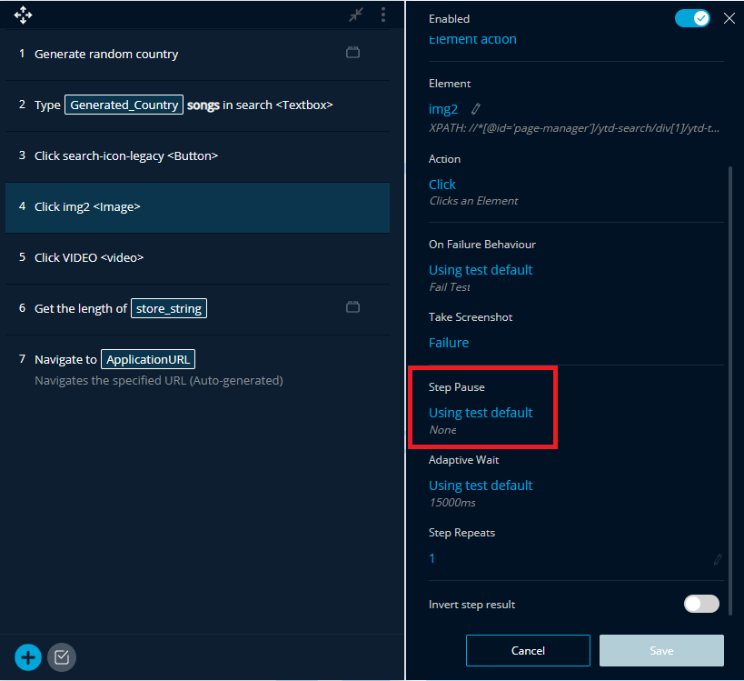
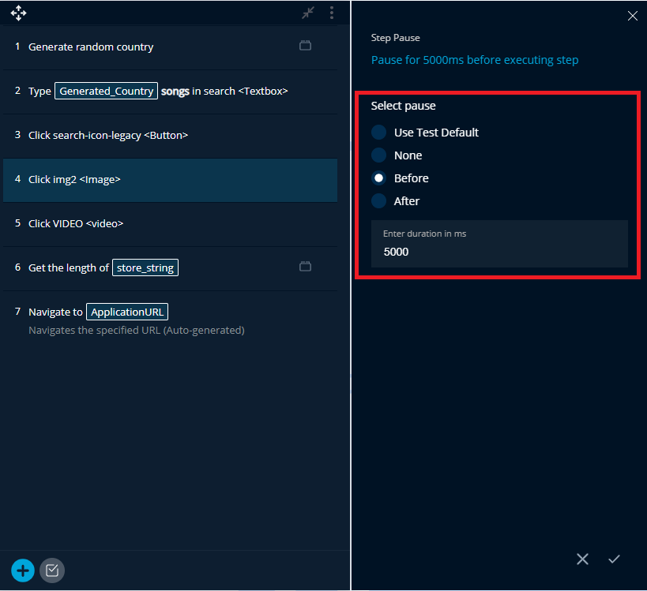
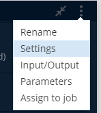
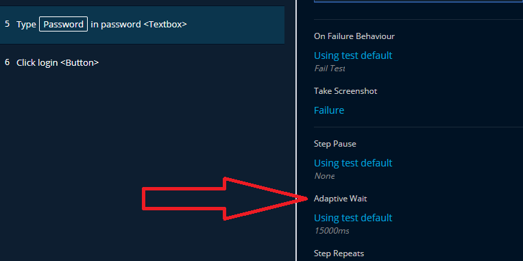
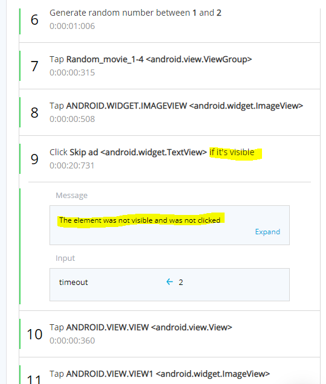
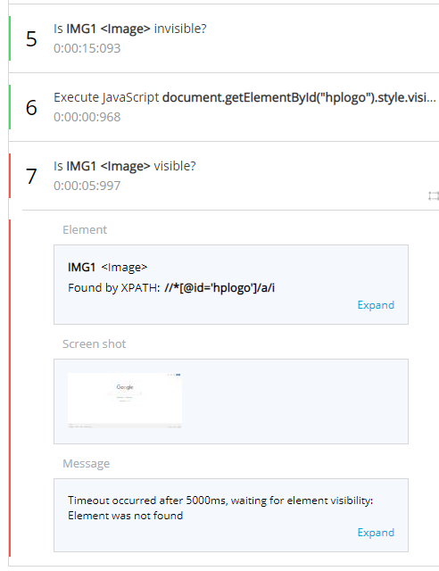

# Explicit Wait & Adaptive Wait

There are various ways to add waits in your tests. Let's review them and understand each one and their differences.

## **Explicit Wait Times**


Explicit wait times are an option available for **each step** of your test as "Step Pause". You can choose to add an explicit wait time either **before** or **after** the execution of your test step.

You will need to set the duration of the wait time in milliseconds.


You can also edit this setting **globally** for each of your test steps by going to the settings of your test and changing the default step pause.

## **Adaptive Wait Time**

To save you time and improve the stability of your tests, we have developed an adaptive wait that knows when to move to the next action. Now, you can trust your tests without having unnecessarily long wait times built in.

### **Adaptive Wait within the TestProject Smart Recorder**

The adaptive wait functionality is located within **every step or validation** in your test. TestProject will adapt to the actual loading pace of your application and execute the next action **only** when the proper conditions are met. You can set the maximum timeout before the step fails \(Set to 15 seconds by default\), so your test will be able to continue even if the conditions are not met.


You can also edit the adaptive wait time globally for your test from the test’s settings:

### **How to use Adaptive Wait with the TestProject SDK**

The adaptive wait functionality also appears in the TestProject SDK. You will be able to use it as long as you use the TestProject web/mobile **driver**.

**Web Example**

In the following example, we will navigate to a URL and input a username and password in their respective fields:

`// This is the test’s execute method, it will contain the actions taken in the test.`

  `public ExecutionResult execute(WebTestHelper helper) throws FailureException {`

`// Leverage the TestProject driver.`

    **`WebDriver driver = helper.getDriver();`**

   `// set timeout for adaptive wait driver actions, by increasing this timeout you increase the maximum threshold that the driver will wait for element to become visible.`

    **`driver.setTimeout(15000);`**

`// The TestProject reporter.`

    `TestReporter report = helper.getReporter();`

    `By by;`

    `boolean booleanResult;`

    `//    Navigates the specified URL.`

    `booleanResult = driver.testproject().navigateToUrl(ApplicationURL);`

    `report.step(String.format("Navigate to '%s'",ApplicationURL), booleanResult, TakeScreenshotConditionType.Failure);`

    `// Type the username.`

    `by = By.cssSelector("#name");`

    `booleanResult = driver.testproject().typeText(by,"Username");`

    `report.step("Type 'Username' in 'name1'", booleanResult, TakeScreenshotConditionType.Failure);`

    `// Type the password.`

    `by = By.cssSelector("#password");`

    `booleanResult = driver.testproject().typeText(by,"12345678");`

    `report.step("Type '12345678' in 'password1'", booleanResult, TakeScreenshotConditionType.Failure);`

`// Report the test as passed.`

    `return ExecutionResult.PASSED;`

  `}`

**Mobile Example**

In the following example, we will use the adaptive wait functionality to wait for an Android Element to appear in a coded test, before tapping on it:

`// This is the test’s execute method, will contain the actions taken in the test.`

`public ExecutionResult execute(AndroidTestHelper helper) throws FailureException {`

   `// Leverage the TestProject driver.`

    **`AndroidDriver driver = helper.getDriver();`**

   `// set timeout for adaptive wait driver actions, by increasing this timeout you increase the maximum threshold that the driver will wait for element to become visible.`

    **`driver.setTimeout(15000);`**

`// The TestProject reporter.`

    `TestReporter report = helper.getReporter();`

    `By by;`

    `boolean booleanResult;`

    `ExecutionResult executionresult;`

`Then, any action you perform will employ an adaptive wait, for example:`

    `// Tap on the element by the locator the ID.`

    `by = By.id("com.google.android.youtube:id/menu_item_1");`

    `booleanResult = driver.testproject().tap(by);`

`// Report the step result via the TestProject reporter.`

`report.step("Tap 'Search1'", booleanResult, TakeScreenshotConditionType.Failure);`

`// Report the test as passed.`

    `return ExecutionResult.PASSED;`

  `}`

### \*\*\*\*

### **Advanced Capabilities: “If visible”**

The **“If visible” actions** are:

* Clear contents \(if visible\)
* Click if visible
* Contains text? \(if visible\)
* Get text \(if visible\)
* Long press gesture \(if visible\)
* Tap \(if visible\)
* Type text \(if visible\)

These actions will consider your set adaptive wait time and **only** be executed if the element you have applied them onto appears on the screen. In case that the element does not appear on the screen, the test will continue without failing, showing 100% pass rate, with an indication in the “If visible” action, saying the element never appeared, causing the step not to execute, but pass regardless.

You can find more details about each one of the actions [here](https://docs.testproject.io/testproject-addons/available-addons/visible-elements-operations-addon#available-actions)**.**

### **Advanced Capabilities: “Is visible”**

The **“Is Visible”** **validations** are:

* Is visible?
* Is invisible?

These validate if the element is visible or invisible on the page or screen and use the adaptive wait mechanism to determine if the step passes or fails.


You can find all available validations and more details [here](https://docs.testproject.io/getting-started/available-validations).

