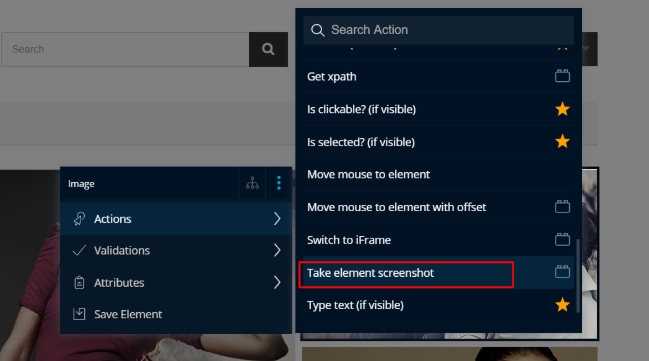

# Image Comparison in TestProject

Comparing images isn't a magic pill in test automation, but it can be a helpful and powerful way to catch changes in the look and feel of an element. The image comparison addon in TestProject makes comparing images from an element a breeze. 

## Installing the Addon

As with any TestProject addon, the installation is a simple as going to addon page and searching for the addon you want \(in this case Image Comparison\) and then clicking on the addon and selecting the install button.

Within seconds the addon will be installed and ready for immediate use in your tests

## Test Setup

For this article we will use the [automationpractice.com](http://automationpractice.com) website to show how you can compare images. If you have not yet used TestProject, check out the documentation on [creating your first test](../using-the-smart-test-recorder/web-testing/creating-a-web-test-using-the-testproject-recorder.md) and setup a project that uses the automation practice website. You can then open the test recorder for that project and hoover over one of the images on the page. Hit shift twice quickly \(double shift\) to freeze that element and in the pop-up menu choose actions and then scroll down the actions list until you find the Take element screenshot action.

Click on this action and in the resulting test step set a path where you want the screen shot to be saved and a name for the image.

Save the test step and it should run and save the image for you. Go to that image location and rename the image to something like `screenshot_standard.jpg`

Now that we have that original image we are ready to setup an image comparison step. To do that add a new test step using the plus button at the bottom of the test step management panel. Change the type from Element Action to action, by clicking on the Element Action link, selecting action and clicking the check mark to apply the changes.

Then fill in the two image paths. Set one of them to the location of the `screenshot_standard.jpg` file created above and the other to the location of where your screenshot will be saved \(something like `screenshot.jpg`\). If you want you can also change the threshold of differences that will constitute a failed test step.

Once you have done that, save the test step and click on the menu arrow beside it and choose the Run until here option to run the test, and just like that you have created a test that effortlessly compares two images!

